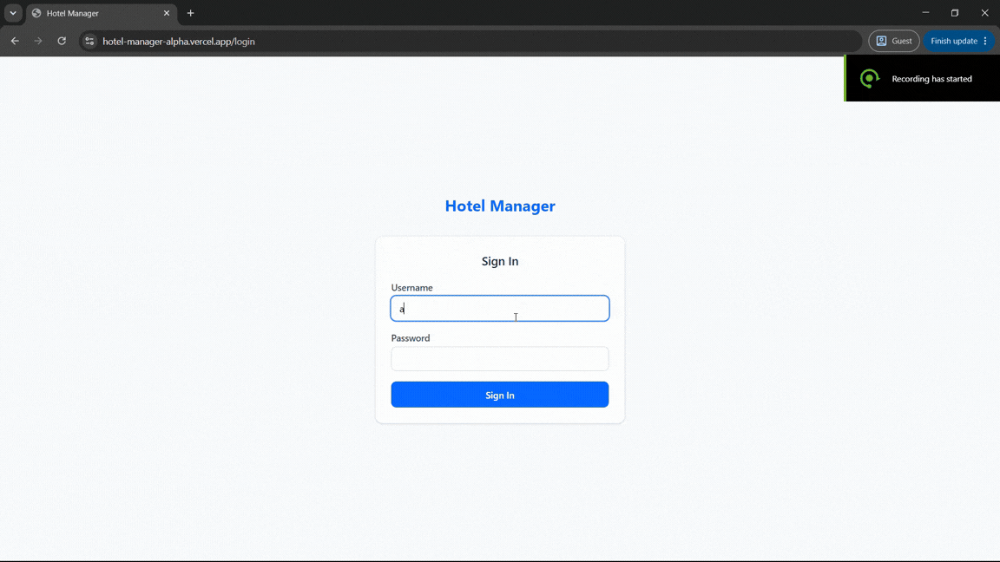

# 🏨 Hotel Manager

> A production-ready Hotel Management System built with **ASP.NET Core 8**, **React 19**, and **Clean Architecture**, inspired by real hotel operations and business workflows.

<p align="center">

[🌐 Live Demo](https://hotel-manager-alpha.vercel.app)
•
[🚀 Backend API](https://hotel-manager.runasp.net)
•
[📚 Engineering Case Study](docs/ENGINEERING.md)

</p>

---


---

## 📸 Preview

🎥 **Quick Demo**

Watch the complete booking workflow in under 2 minutes.

| 🖥️ Hotel Demo                                                            |
| :----------------------------------------------------------------------- |
|  |
---

# Why This Project?

This project was inspired by my previous experience working as a **hotel receptionist**.

Instead of building another CRUD application, I wanted to solve real operational problems that hotel staff face every day, including booking management, guest registration, payments, room availability, reporting, and business day operations.

The goal was to combine **real hospitality domain knowledge** with modern software engineering practices.

---

# Live Demo

| Service | Link |
|---------|------|
| Frontend | https://hotel-manager-alpha.vercel.app |
| Backend API | https://hotel-manager.runasp.net |

---

# Key Features

## Hotel Operations

- Guest Management
- Room Management
- Booking Management
- Multiple Guests per Booking
- Payment Tracking
- Outstanding Balance Calculation
- Daily Reports
- Period Reports
- Employee Management

---

## Business Rules

- Room availability validation
- Prevent double booking
- Night Audit / Business Day workflow
- Booking lifecycle management
- Outstanding balance calculation
- Booking extension
- Booking cancellation (Admin only)

---

## Security

- JWT Authentication
- BCrypt Password Hashing
- Role-Based Authorization
- FluentValidation
- Login Rate Limiting
- Global Exception Handling

---

## User Experience

- Responsive UI
- Dark Mode
- English / Arabic
- RTL Support
- Mobile Friendly

---

# Technology Stack

## Backend

- ASP.NET Core 8
- Entity Framework Core 8
- SQL Server
- PostgreSQL Support
- FluentValidation
- JWT
- BCrypt
- Serilog

## Frontend

- React 19
- TypeScript
- Vite
- Tailwind CSS
- Axios
- React Router

## DevOps

- GitHub Actions
- MonsterASP.NET
- Vercel

---

# Architecture

The solution follows **Clean Architecture** to separate business rules from infrastructure and presentation concerns.

```
Frontend (React)
        │
        ▼
ASP.NET Core API
        │
        ▼
Application
        │
        ▼
Domain
        ▲
        │
Infrastructure
```

For the complete architecture explanation:

➡ **docs/ENGINEERING.md**

---

# Engineering Highlights

✔ Clean Architecture

✔ 75 Automated Tests

✔ CI/CD Pipeline

✔ Production Deployment

✔ Dependency Injection

✔ DTO-based API

✔ Thin Controllers

✔ FluentValidation

✔ Global Exception Middleware

✔ AsNoTracking Query Optimization

✔ Service Decomposition

✔ Business-driven Design

---

# Testing

Current test suite includes

- Service Tests
- Validator Tests
- Business Helper Tests

Result

✅ 75 Passing Tests

---

# Deployment

Frontend

- Vercel

Backend

- MonsterASP.NET

Deployment

- GitHub Actions

HTTPS

- Enabled

---

# Project Structure

```
HotelManager/

src/
    HotelManager.API
    HotelManager.Application
    HotelManager.Domain
    HotelManager.Infrastructure

frontend/

tests/

docs/
```

---

# Engineering Documentation

This repository includes a complete engineering case study covering the technical decisions behind the project.

Topics include:

- Business Analysis
- Architecture
- Request Lifecycle
- Authentication
- Business Rules
- Deployment
- Testing
- Performance
- Engineering Decisions
- Lessons Learned

📖 **Read:**

docs/ENGINEERING.md

---

# Roadmap

## Completed

- Clean Architecture
- JWT Authentication
- CI/CD
- Production Deployment
- Unit Testing
- Responsive UI
- Dark Mode
- Arabic Localization

## Planned

- Refresh Tokens

- Docker Compose

- Integration Tests

- Health Checks

- EF Core Migrations

---

# About Me

Hi, I'm **Ahmed**.

I'm transitioning into software engineering after working in hotel operations.

This project combines my hospitality domain experience with modern full-stack development using ASP.NET Core and React.

I'm currently seeking my first Software Engineer opportunity where I can contribute, continue learning, and grow alongside experienced engineers.

If you have feedback or would like to discuss the project, I'd be happy to connect.

---

⭐ If you found this project interesting, consider giving it a star.
