# 🏨 Hotel Manager

> **A production-ready hotel management platform built with ASP.NET Core 8, React 19, and Clean Architecture.**
>
> Designed to streamline hotel operations through secure authentication, maintainable architecture, and real-world business workflows.

<p align="center">

[](#)
[](#)
[](#)
[](#)
[](#)
[](#)
[](#)
[](#)

</p>

---

## 🌐 Live Application

| Component     | Link                                   |
| ------------- | -------------------------------------- |
| 🖥 Frontend   | https://hotel-manager-alpha.vercel.app |
| ⚙ Backend API | https://hotel-manager.runasp.net       |

---

## ✨ Engineering Highlights

- Clean Architecture with clear separation of concerns
- Production deployment with automated CI/CD
- JWT authentication with role-based authorization
- BCrypt password hashing
- FluentValidation request validation
- SQL Server + Entity Framework Core
- Rate limiting and security headers
- Automated unit testing
- Docker-ready backend
- Responsive React 19 frontend with Arabic (RTL) support

---

# 📖 Project Overview

**Hotel Manager** is a full-stack hotel management platform designed to streamline the daily operations of small and medium-sized hotels. It centralizes room management, guest registration, reservations, payments, and staff operations while enforcing real-world hospitality business rules to ensure operational accuracy and consistency.

Unlike many portfolio projects that focus primarily on CRUD operations, this project was designed to model realistic hotel workflows and demonstrate professional software engineering practices. The system implements domain-specific business rules such as room availability validation, booking lifecycle management, payment tracking, role-based access control, and a configurable **Business Day** concept that separates operational days from calendar days. By allowing the hotel's business day to end at **12:00 PM (Noon)** instead of midnight, the application accurately supports night audit operations and aligns with how many hotels manage overnight stays and daily financial reconciliation.

The backend is built with **ASP.NET Core 8** following **Clean Architecture**, exposing a secure RESTful API protected with JWT authentication. The frontend is developed using **React 19**, **TypeScript**, and **Tailwind CSS v4**, providing a responsive user experience with full Arabic (RTL) support, dark mode, and a modern administrative interface.

Beyond feature implementation, the project emphasizes maintainability, scalability, and separation of concerns. Business logic is isolated from infrastructure, application services remain independently testable, and the solution follows modern development practices including dependency injection, FluentValidation, structured logging, centralized exception handling, Entity Framework Core, automated unit testing, rate limiting, Docker support, and an automated CI/CD deployment pipeline.

Although developed as a portfolio project rather than commercial software, the application reflects the architecture, development workflow, and engineering principles commonly used in professional ASP.NET Core teams. Every technical decision was made with the objective of building software that is clean, maintainable, extensible, and representative of production-oriented development practices.

# 💡 Why I Built This

Before transitioning into software engineering, I worked as a **hotel receptionist**, where I experienced the day-to-day operational challenges of running a hotel. I worked directly with reservations, guest check-ins and check-outs, room availability, payments, and daily operational procedures. This firsthand experience gave me a practical understanding of how hotel systems support employees and why certain business rules exist.

When I decided to pursue software development, I chose to build **Hotel Manager** because it allowed me to combine my previous domain knowledge with modern software engineering practices. Rather than creating another generic CRUD application, I wanted to model real hotel operations and transform business requirements into a maintainable, scalable software solution.

Throughout the project, my goal was not only to practice ASP.NET Core or React, but to build software the way professional development teams do. I focused on applying engineering principles such as Clean Architecture, separation of concerns, dependency injection, validation, secure authentication, automated testing, and continuous deployment while keeping the codebase clean, maintainable, and easy to extend.

One example of this domain-driven approach is the implementation of the **Hotel Business Day**. From my experience, I knew that hotel operations do not necessarily end at midnight. Many hotels complete their daily operations after the **Night Audit**, often around **12:00 PM (Noon)**. To reflect this real-world workflow, the application introduces a configurable Business Day that separates operational dates from calendar dates, improving the accuracy of occupancy calculations, reservation management, operational reporting, and financial reconciliation.

Building this project also gave me the opportunity to experience the complete software development lifecycle—from requirements analysis and domain modeling to backend development, frontend integration, testing, deployment, and continuous delivery. Every architectural decision was made with the objective of producing software that is maintainable, secure, and representative of professional ASP.NET Core development.

For me, Hotel Manager represents the intersection of two careers—hospitality and software engineering. It reflects my ability to transform real operational experience into maintainable software that solves practical business problems.

# 🌐 Live Demo

The application is publicly deployed and continuously updated through an automated GitHub Actions deployment pipeline.

| Component                       |       Status        | Link                                         |
| ------------------------------- | :-----------------: | -------------------------------------------- |
| **Frontend Application**        |       ✅ Live       | https://hotel-manager-alpha.vercel.app       |
| **Backend REST API**            |       ✅ Live       | https://hotel-manager.runasp.net             |
| **API Documentation (Swagger)** | 🔒 Development Only | Disabled in production for security purposes |

---

## Deployment Architecture

| Layer       | Platform                     |
| ----------- | ---------------------------- |
| Frontend    | Vercel                       |
| Backend API | MonsterASP.net (Windows IIS) |
| Database    | Microsoft SQL Server         |
| CI/CD       | GitHub Actions + Web Deploy  |

---

## Deployment Workflow

Every push to the **main** branch automatically triggers the deployment pipeline:

```text
Developer
     │
     ▼
GitHub Repository
     │
     ▼
GitHub Actions
     │
     ▼
Build & Publish (.NET 8)
     │
     ▼
Web Deploy
     │
     ▼
MonsterASP.net
     │
     ▼
Live Application
```

This workflow ensures that the deployed application always reflects the latest version of the source code while reducing manual deployment steps and maintaining a repeatable release process.

> **Note:** Swagger is intentionally available only in the Development environment. Disabling API documentation in production is a deliberate security decision to reduce unnecessary public exposure of implementation details.

# ✨ Feature Showcase

Hotel Manager is designed to support the day-to-day operations of a hotel by combining operational workflows, business rules, and administrative tools into a single platform. Rather than implementing isolated CRUD operations, the system models how hotel staff interact with reservations, guests, rooms, and financial records throughout the hotel's operational day.

---

## 🛎 Reservation Management

- Create, update, extend, complete, and cancel reservations
- Prevent double-booking through room availability validation
- Automatic booking lifecycle management
- Flexible search, filtering, and pagination
- Reservation history and status tracking

---

## 🛏 Room Management

- Manage room inventory
- Room categories and pricing
- Occupancy status tracking
- Availability validation before reservation
- Active booking association

---

## 👥 Guest Management

- Guest registration and profile management
- Multiple guests per reservation
- Contact information management
- Guest search capabilities

---

## 💳 Payment Management

- Record and manage booking payments
- Outstanding balance calculation
- Payment history tracking
- Booking-payment relationship management

---

## 👨‍💼 Employee & Access Management

- Secure employee authentication
- Role-based authorization (Owner / Employee)
- Protected administrative operations
- Password hashing using BCrypt
- JWT-based authentication

---

## 📅 Hotel Operations

Designed around real hospitality workflows rather than calendar assumptions.

### Business Day

Unlike standard applications that rely on calendar dates, the system introduces the concept of a configurable **Hotel Business Day**.

This allows hotels to:

- Continue overnight operations without prematurely closing the day
- Perform Night Audit procedures
- Generate operational reports accurately
- Maintain correct occupancy calculations
- Support hotels whose operational day ends at **12:00 PM (Noon)** instead of midnight

This business rule was inspired by real hotel operations and reflects how many hospitality businesses organize their daily workflow.

---

## 📊 Reporting & Administration

- Booking summaries
- Outstanding balances
- Occupancy information
- Reservation statistics
- Administrative dashboard

---

## 🔒 Security

Security was considered from the beginning of the project rather than added later.

Implemented protections include:

- JWT Authentication
- Role-Based Authorization
- BCrypt Password Hashing
- FluentValidation
- Rate Limiting
- Security Headers
- Centralized Exception Handling

---

## 🎨 User Experience

- Responsive interface
- Mobile-friendly design
- Arabic (RTL) support
- Dark Mode
- Modern dashboard experience

---

## 🚀 Engineering Features

Beyond end-user functionality, the project demonstrates modern engineering practices:

- Clean Architecture
- RESTful API Design
- Dependency Injection
- Entity Framework Core
- Automated Unit Testing
- GitHub Actions CI/CD
- Docker Support
- SQL Server
- Structured Logging
- Separation of Concerns

# 🏛️ Architecture at a Glance

Hotel Manager is built using **Clean Architecture**, an architectural approach that separates business rules from frameworks, databases, and user interfaces. The primary objective is to create a codebase that is maintainable, testable, and adaptable as business requirements evolve.

Instead of tightly coupling business logic to ASP.NET Core, Entity Framework Core, or SQL Server, each layer has a single, well-defined responsibility and depends only on abstractions. This allows implementation details to change without affecting the application's core business logic.

---

## Architecture Overview

```text
                         ┌───────────────────────┐
                         │     React 19 UI       │
                         │ TypeScript + Tailwind │
                         └───────────┬───────────┘
                                     │ HTTP / REST
                                     ▼
                    ┌────────────────────────────────┐
                    │       ASP.NET Core API         │
                    │ Controllers • Authentication   │
                    └───────────────┬────────────────┘
                                    │
                                    ▼
                    ┌────────────────────────────────┐
                    │      Application Layer         │
                    │ Services • DTOs • Validation   │
                    └───────────────┬────────────────┘
                                    │
                                    ▼
                    ┌────────────────────────────────┐
                    │         Domain Layer           │
                    │ Entities • Enums • Rules       │
                    └───────────────┬────────────────┘
                                    │
                                    ▼
                    ┌────────────────────────────────┐
                    │      Infrastructure Layer      │
                    │ EF Core • SQL Server • JWT     │
                    └────────────────────────────────┘
```

---

## Layer Responsibilities

### 🎨 Presentation Layer (React + ASP.NET Core API)

Responsible for user interaction and HTTP communication.

**Responsibilities**

- Receive HTTP requests
- Validate request format
- Authenticate and authorize users
- Return standardized API responses
- Never contain business logic

---

### ⚙️ Application Layer

Coordinates business use cases and application workflows.

**Responsibilities**

- Execute business operations
- Orchestrate services
- Apply validation
- Map entities to DTOs
- Communicate through interfaces
- Remain independent from infrastructure

Examples include:

- BookingService
- AuthService
- RoomService
- PaymentService

---

### 🧠 Domain Layer

Represents the core business model of the hotel.

Contains business entities such as:

- Booking
- Room
- Guest
- Payment
- Employee

This layer defines the language of the business and remains independent of databases, web frameworks, and external technologies.

Although intentionally lightweight in this project, the domain model captures business concepts and relationships while allowing business logic to evolve without framework dependencies.

---

### 🗄️ Infrastructure Layer

Implements technical concerns required by the application.

Responsibilities include:

- Entity Framework Core
- SQL Server persistence
- JWT token generation
- Repository implementations
- External integrations
- Dependency injection registrations

Infrastructure can change without requiring modifications to the application's business rules.

---

# 🔄 Request Lifecycle

A typical reservation request follows this flow:

```text
User
   │
   ▼
React Application
   │
   ▼
BookingsController
   │
   ▼
BookingService
   │
   ▼
Business Validation
(Room Availability,
Business Rules,
Authorization)
   │
   ▼
Entity Framework Core
   │
   ▼
SQL Server
   │
   ▼
Response DTO
   │
   ▼
Client
```

Each layer performs only the responsibilities assigned to it, reducing coupling and improving maintainability.

---

# 🎯 Key Architectural Decisions

## Why Clean Architecture?

The project adopts Clean Architecture to ensure that business logic remains independent of frameworks and infrastructure.

This provides several long-term benefits:

- Clear separation of concerns
- Easier unit testing
- Improved maintainability
- Reduced coupling
- Better scalability
- Easier replacement of infrastructure components
- More predictable code organization

---

## Why Services Instead of Fat Controllers?

Controllers are intentionally kept thin.

Their responsibility is limited to:

- Receiving HTTP requests
- Calling application services
- Returning HTTP responses

Business rules remain inside the Application layer, making them reusable and easier to test.

---

## Why Dependency Injection?

Dependency Injection allows components to depend on abstractions rather than concrete implementations.

Benefits include:

- Loose coupling
- Easier testing
- Better maintainability
- Flexible implementations
- Clear dependency management

---

## Why DTOs?

Domain entities are never exposed directly to clients.

DTOs provide:

- Stable API contracts
- Better security
- Reduced over-fetching
- Versioning flexibility
- Separation between persistence and presentation

---

## Why FluentValidation?

Validation is centralized rather than scattered across controllers or services.

This keeps:

- Controllers focused on HTTP concerns
- Services focused on business logic
- Validation rules consistent and reusable

---

## Architectural Principles Applied

Throughout the project, the following engineering principles guided implementation:

- Separation of Concerns (SoC)
- SOLID Principles
- Dependency Inversion Principle (DIP)
- Single Responsibility Principle (SRP)
- RESTful API Design
- Composition over Coupling
- Clean Code Practices
- Defensive Programming

# 🧩 Key Engineering Decisions

Every significant technology and architectural choice in this project was made to solve a specific problem rather than simply include popular frameworks. The following decisions reflect the reasoning behind the implementation.

---

## 🏛 Why Clean Architecture?

The project follows Clean Architecture to separate business rules from infrastructure and framework-specific code.

This approach provides several long-term advantages:

- Business logic remains independent of ASP.NET Core and Entity Framework Core.
- Infrastructure can evolve without affecting domain logic.
- Application services are easier to test.
- Responsibilities are clearly separated.
- The solution can grow without becoming tightly coupled.

For a business application expected to evolve over time, maintainability was prioritized over short-term development speed.

---

## ⚙ Why ASP.NET Core?

ASP.NET Core was selected because it is a modern, cross-platform framework that provides:

- Excellent performance
- Built-in dependency injection
- Robust authentication and authorization
- Strong ecosystem
- Long-term Microsoft support

These capabilities make it well suited for scalable business applications.

---

## 🗄 Why Entity Framework Core?

Entity Framework Core was chosen because it allows development to focus on business requirements rather than repetitive database access code.

Benefits include:

- LINQ queries
- Change tracking
- Relationship management
- Database provider flexibility
- Strong integration with ASP.NET Core

For this project, EF Core provided the right balance between productivity, maintainability, and performance.

---

## 💾 Why SQL Server?

The production environment currently uses **Microsoft SQL Server** hosted on MonsterASP.net.

SQL Server was selected because it integrates seamlessly with the chosen hosting provider and offers a reliable relational database platform for transactional business applications.

The application's data access layer remains provider-independent through Entity Framework Core.

### Database Portability

The project was originally planned for deployment on **Render** using **PostgreSQL**. Although deployment constraints led to SQL Server in production, the application architecture was intentionally designed to support multiple EF Core providers with minimal code changes.

This demonstrates portability and avoids unnecessary dependency on a single database engine.

---

## 🔐 Why JWT Authentication?

JWT enables stateless authentication, making the API independent of server-side session storage.

Benefits include:

- Scalable authentication
- REST-friendly design
- Separation between frontend and backend
- Easy integration with modern web clients

Access is further protected using role-based authorization.

---

## 🔒 Why BCrypt?

Passwords are never stored in plain text.

BCrypt was selected because it:

- Automatically generates salts
- Is intentionally computationally expensive
- Helps mitigate brute-force attacks
- Is widely adopted for secure password storage

---

## ✅ Why FluentValidation?

Validation rules are centralized using FluentValidation rather than being scattered across controllers.

This provides:

- Cleaner controllers
- Reusable validation rules
- Consistent request validation
- Better separation of concerns

---

## 🧪 Why Automated Testing?

Business logic is protected by automated tests to increase confidence during refactoring and future development.

The objective is not only to verify correctness but also to ensure that business rules remain stable as the application evolves.

---

## 🚀 Why CI/CD?

Manual deployments are repetitive and error-prone.

GitHub Actions automatically builds and deploys the application whenever changes are pushed to the `main` branch.

This provides:

- Repeatable deployments
- Faster delivery
- Reduced manual work
- Consistent release process

---

## 🐳 Why Docker?

Although the production environment currently uses IIS hosting, the backend includes Docker support to simplify local development and future deployment options.

Containerization prepares the project for cloud-native hosting platforms without requiring architectural changes.

---

## 🎨 Why React + TypeScript?

React provides a component-based architecture suitable for building interactive administrative dashboards.

TypeScript adds static typing, improving maintainability, refactoring safety, and developer productivity as the project grows.

---

## 🌍 Why Arabic (RTL) Support?

From the beginning, the application was designed with its target users in mind.

Full Arabic localization and Right-to-Left (RTL) support make the system more practical for hotels operating in Arabic-speaking environments while maintaining a modern and responsive user experience.

---

## 🎯 Engineering Philosophy

Throughout the project, every decision was guided by one principle:

> **Choose technologies because they solve a problem—not because they are popular.**

The objective was to build software that is maintainable, understandable, secure, and representative of professional engineering practices rather than maximizing the number of technologies used.

# 📁 Project Structure

Hotel Manager is a **full-stack hotel management system** consisting of a modern React frontend, an ASP.NET Core Web API backend, a layered application following **Clean Architecture**, automated tests, and a production deployment pipeline.

The solution is organized so that each project has a single responsibility while remaining loosely coupled with the others.

```text
HotelManager/
│
├── 📁 .github/
│   └── 📁 workflows/
│       └── 📄 deploy.yml                      ← GitHub Actions auto-deploy to MonsterASP.NET
│
├── 📄 HotelManager.sln                        ← .NET Solution file
├── 📄 README.md
├── 📄 AGENTS.md                               ← Architecture conventions & onboarding
├── 📄 Dockerfile
├── 📄 .gitignore
├── 📄 skills-lock.json                        ← opencode agent skill lock
│
├── 📁 frontend/                               ← React + Vite SPA
│   ├── 📄 index.html                          ← SPA entry
│   ├── 📄 vite.config.js                      ← Vite config + proxy /api → localhost:5293
│   ├── 📄 vercel.json                         ← SPA rewrites for Vercel
│   ├── 📄 package.json                        ← React 19, axios, i18next, react-router
│   ├── 📄 eslint.config.js
│   ├── 📄 .gitignore
│   ├── 📄 README.md
│   ├── 📁 public/
│   │   ├── 📄 favicon.svg
│   │   └── 📄 icons.svg
│   └── 📁 src/
│       ├── 📄 main.jsx                        ← ReactDOM.createRoot
│       ├── 📄 App.jsx                         ← Routes config
│       ├── 📄 index.css                       ← Tailwind + dark mode
│       ├── 📁 api/
│       │   └── 📄 client.js                   ← Axios instance + Bearer token interceptor
│       ├── 📁 context/
│       │   ├── 📄 AuthContext.jsx             ← login/logout/register/role state
│       │   └── 📄 ThemeContext.jsx            ← dark/light mode toggle
│       ├── 📁 i18n/
│       │   ├── 📄 index.js                   ← i18next init (EN/AR + RTL)
│       │   ├── 📄 en.json                    ← English translations
│       │   └── 📄 ar.json                    ← Arabic translations
│       ├── 📁 components/
│       │   ├── 📄 Layout.jsx                 ← Navbar + sidebar + <Outlet/>
│       │   ├── 📄 ProtectedRoute.jsx         ← Auth guard → redirect to /login
│       │   ├── 📄 LangSwitcher.jsx           ← EN/AR toggle
│       │   └── 📄 ThemeToggle.jsx            ← dark/light toggle
│       └── 📁 pages/
│           ├── 📄 Login.jsx
│           ├── 📄 Bookings.jsx               ← List + search + filters
│           ├── 📄 BookingDetail.jsx          ← Detail + payments + extend
│           ├── 📄 NewBooking.jsx             ← Create booking form
│           ├── 📄 Rooms.jsx                  ← List + status
│           ├── 📄 NewRoom.jsx                ← Create room form
│           ├── 📄 Guests.jsx                 ← List + search
│           ├── 📄 GuestDetail.jsx            ← Detail + booking history
│           ├── 📄 NewGuest.jsx               ← Create guest form
│           └── 📄 Reports.jsx                ← Daily/period/outstanding reports
│
├── 📁 src/
│   ├── 📦 HotelManager.API/                  ← ASP.NET Web API entry point
│   │   ├── 📄 Program.cs                     ← App builder, middleware pipeline, seeding
│   │   ├── 📄 HotelManager.API.csproj        ← Targets net8.0
│   │   ├── 📄 HotelManager.API.http          ← HTTP endpoint test file
│   │   ├── 📄 appsettings.json               ← Shared config (no secrets)
│   │   ├── 📄 appsettings.Development.json   ← Local secrets (gitignored)
│   │   ├── 📁 Properties/
│   │   │   └── 📄 launchSettings.json        ← IIS Express + Kestrel profiles
│   │   ├── 📁 Controllers/
│   │   │   ├── 📄 AuthController.cs          ← POST login, change-password
│   │   │   ├── 📄 BookingsController.cs      ← CRUD + extend/complete/cancel
│   │   │   ├── 📄 GuestsController.cs        ← CRUD + search
│   │   │   ├── 📄 RoomsController.cs         ← CRUD + toggle-maintenance
│   │   │   ├── 📄 PaymentsController.cs      ← POST add-payment
│   │   │   ├── 📄 ReportsController.cs       ← GET daily/period/outstanding
│   │   │   └── 📄 UsersController.cs         ← CRUD employees
│   │   ├── 📁 Middleware/
│   │   │   └── 📄 GlobalExceptionHandler.cs  ← Exception → ProblemDetails RFC 7807
│   │   └── 📁 Extensions/
│   │       ├── 📄 ServicesExtensions.cs      ← DI registration (DbContext, services, validators)
│   │       ├── 📄 AuthExtensions.cs          ← JWT Bearer config + ClockSkew=0
│   │       ├── 📄 SwaggerExtensions.cs       ← Swagger + JWT security definition
│   │       └── 📄 ClaimsPrincipalExtensions.cs ← GetUserId() helper
│   │
│   ├── 📦 HotelManager.Application/          ← Use cases & business logic
│   │   ├── 📄 GlobalUsings.cs
│   │   ├── 📄 HotelManager.Application.csproj
│   │   ├── 📁 Common/
│   │   │   ├── 📄 BookingCalculator.cs       ← Nights/TotalCost/TotalPaid/Balance
│   │   │   ├── 📄 BookingMappings.cs         ← ToSummaryDto() / ToDetailDto() extensions
│   │   │   └── 📄 BusinessDateHelper.cs      ← FirstDayOfMonth / LastDayOfMonth
│   │   ├── 📁 DTOs/
│   │   │   ├── 📁 Auth/
│   │   │   │   ├── 📄 LoginRequest.cs
│   │   │   │   ├── 📄 LoginResponse.cs
│   │   │   │   └── 📄 ChangePasswordRequest.cs
│   │   │   ├── 📁 Bookings/
│   │   │   │   ├── 📄 CreateBookingRequest.cs
│   │   │   │   ├── 📄 ExtendBookingRequest.cs
│   │   │   │   ├── 📄 BookingFilterRequest.cs
│   │   │   │   ├── 📄 BookingSummaryDto.cs
│   │   │   │   └── 📄 BookingDto.cs
│   │   │   ├── 📁 Common/
│   │   │   │   └── 📄 PagedResult.cs
│   │   │   ├── 📁 Guests/
│   │   │   │   ├── 📄 CreateGuestRequest.cs
│   │   │   │   ├── 📄 UpdateGuestRequest.cs
│   │   │   │   ├── 📄 GuestFilterRequest.cs
│   │   │   │   ├── 📄 GuestSummaryDto.cs
│   │   │   │   └── 📄 GuestDto.cs
│   │   │   ├── 📁 Payments/
│   │   │   │   ├── 📄 AddPaymentRequest.cs
│   │   │   │   └── 📄 PaymentDto.cs
│   │   │   ├── 📁 Reports/
│   │   │   │   ├── 📄 DailyReportDto.cs
│   │   │   │   ├── 📄 PeriodReportDto.cs
│   │   │   │   └── 📄 OutstandingBalanceDto.cs
│   │   │   ├── 📁 Rooms/
│   │   │   │   ├── 📄 CreateRoomRequest.cs
│   │   │   │   ├── 📄 UpdateRoomRequest.cs
│   │   │   │   ├── 📄 RoomFilterRequest.cs
│   │   │   │   └── 📄 RoomDto.cs
│   │   │   └── 📁 Users/
│   │   │       ├── 📄 CreateEmployeeRequest.cs
│   │   │       └── 📄 UserDto.cs
│   │   ├── 📁 Services/
│   │   │   ├── 📁 Interfaces/
│   │   │   │   ├── 📄 IAuthService.cs
│   │   │   │   ├── 📄 IUserService.cs
│   │   │   │   ├── 📄 IRoomService.cs
│   │   │   │   ├── 📄 IGuestService.cs
│   │   │   │   ├── 📄 IBookingService.cs
│   │   │   │   ├── 📄 IBookingQueryService.cs          ← Extracted query read-models
│   │   │   │   ├── 📄 IBookingAvailabilityService.cs   ← Extracted room availability check
│   │   │   │   ├── 📄 IPaymentService.cs
│   │   │   │   ├── 📄 IReportService.cs
│   │   │   │   └── 📄 IJwtTokenService.cs
│   │   │   ├── 📄 AuthService.cs               ← Login, change password, BCrypt verify
│   │   │   ├── 📄 UserService.cs               ← CRUD employees
│   │   │   ├── 📄 RoomService.cs               ← CRUD rooms + toggle maintenance
│   │   │   ├── 📄 GuestService.cs              ← CRUD guests + search
│   │   │   ├── 📄 BookingService.cs            ← Create, extend, complete, cancel
│   │   │   ├── 📄 BookingQueryService.cs       ← GetActive/Completed/Cancelled/ById/Search/Filter
│   │   │   ├── 📄 BookingAvailabilityService.cs ← IsRoomAvailable()
│   │   │   ├── 📄 PaymentService.cs            ← Add payment
│   │   │   └── 📄 ReportService.cs             ← Daily report, period report, outstanding balances
│   │   └── 📁 Validators/                      ← FluentValidation (10 validators, auto-applied)
│   │       ├── 📄 CreateBookingRequestValidator.cs
│   │       ├── 📄 ExtendBookingRequestValidator.cs
│   │       ├── 📄 CreateGuestRequestValidator.cs
│   │       ├── 📄 UpdateGuestRequestValidator.cs
│   │       ├── 📄 CreateRoomRequestValidator.cs
│   │       ├── 📄 UpdateRoomRequestValidator.cs
│   │       ├── 📄 AddPaymentRequestValidator.cs
│   │       ├── 📄 CreateEmployeeRequestValidator.cs
│   │       ├── 📄 ChangePasswordRequestValidator.cs
│   │       └── 📄 LoginRequestValidator.cs
│   │
│   ├── 📦 HotelManager.Domain/                 ← Innermost layer (zero dependencies)
│   │   ├── 📄 HotelManager.Domain.csproj
│   │   ├── 📁 Entities/
│   │   │   ├── 📄 Room.cs                      ← Number, Floor, PricePerNight, RoomStatus, BathroomType
│   │   │   ├── 📄 Guest.cs                     ← FullName, NationalId, Address, Phone
│   │   │   ├── 📄 Booking.cs                   ← RoomId, CheckIn, CheckOut, PricePerNight, Status
│   │   │   ├── 📄 BookingGuest.cs              ← Join table: BookingId, GuestId, IsPrimary
│   │   │   ├── 📄 Payment.cs                   ← BookingId, Amount, PaymentDate, Notes
│   │   │   └── 📄 User.cs                      ← Username, PasswordHash, Role
│   │   ├── 📁 Enums/
│   │   │   ├── 📄 BookingStatus.cs             ← Active, Completed, Cancelled
│   │   │   ├── 📄 UserRole.cs                  ← Owner, Admin, Receptionist
│   │   │   └── 📄 BathroomType.cs              ← Private, Shared
│   │   └── 📁 Interfaces/
│   │       └── 📄 IApplicationDbContext.cs     ← DbSet<T> specs + SaveChangesAsync
│   │
│   └── 📦 HotelManager.Infrastructure/         ← EF Core, JWT, external concerns
│       ├── 📄 GlobalUsings.cs
│       ├── 📄 HotelManager.Infrastructure.csproj
│       ├── 📁 Persistence/
│       │   ├── 📄 ApplicationDbContext.cs      ← DbContext (6 DbSets)
│       │   ├── 📄 DbInitializer.cs             ← EnsureCreated + seed admin user
│       │   └── 📁 Configurations/              ← IEntityTypeConfiguration<T> fluent API
│       │       ├── 📄 BookingConfiguration.cs
│       │       ├── 📄 BookingGuestConfiguration.cs
│       │       ├── 📄 GuestConfiguration.cs
│       │       ├── 📄 PaymentConfiguration.cs
│       │       ├── 📄 RoomConfiguration.cs
│       │       └── 📄 UserConfiguration.cs
│       └── 📁 Security/
│           └── 📄 JwtTokenService.cs           ← HMAC-SHA256 token generation
│
└── 📁 tests/
    └── 🧪 HotelManager.Application.Tests/      ← xUnit + FluentAssertions + EF Core InMemory
        ├── 📄 GlobalUsings.cs
        ├── 📄 HotelManager.Application.Tests.csproj
        ├── 📁 TestCommon/
        │   └── 📄 MockDbContext.cs             ← InMemory builder with seed helpers
        ├── 📁 Common/
        │   ├── 📄 BookingCalculatorTests.cs
        │   └── 📄 BusinessDateHelperTests.cs
        ├── 📁 Services/
        │   ├── 📄 AuthServiceTests.cs
        │   ├── 📄 BookingServiceTests.cs
        │   ├── 📄 GuestServiceTests.cs
        │   ├── 📄 PaymentServiceTests.cs
        │   └── 📄 RoomServiceTests.cs
        └── 📁 Validators/
            ├── 📄 CreateGuestRequestValidatorTests.cs
            ├── 📄 CreateRoomRequestValidatorTests.cs
            ├── 📄 CreateBookingRequestValidatorTests.cs
            ├── 📄 AddPaymentRequestValidatorTests.cs
            └── 📄 LoginRequestValidatorTests.cs

```

---

# Solution Overview

## 🎨 Frontend (`frontend/`)

The frontend is built with **React 19**, **TypeScript**, and **Tailwind CSS v4** as a modern Single Page Application (SPA).

It is responsible for:

- User interface
- Authentication state management
- Route protection
- API communication through Axios
- Arabic (RTL) & English localization
- Dark mode
- Responsive experience across desktop and mobile devices

The frontend contains **no business logic**. It consumes the REST API and presents data to users.

---

## 🌐 API Layer (`HotelManager.API`)

The API project exposes REST endpoints and acts as the application's HTTP entry point.

Responsibilities include:

- REST Controllers
- Authentication & Authorization
- Middleware
- Dependency Injection
- HTTP Pipeline Configuration
- Global Exception Handling (ProblemDetails)

Controllers intentionally remain thin, delegating business operations to the Application layer.

---

## ⚙️ Application Layer (`HotelManager.Application`)

The Application layer contains the system's use cases and business workflows.

Responsibilities include:

- Application Services
- DTOs
- FluentValidation
- Mapping
- Business Calculations
- Business Date utilities
- Service Interfaces

Rather than placing all booking logic inside a single large service, responsibilities are intentionally separated.

### Booking Module

The booking workflow follows an orchestration approach:

| Service                        | Responsibility                                                            |
| ------------------------------ | ------------------------------------------------------------------------- |
| **BookingService**             | Coordinates booking use cases (Create, Extend, Complete, Cancel)          |
| **BookingQueryService**        | Read operations, searching, filtering, GetById, active/completed bookings |
| **BookingAvailabilityService** | Room availability validation and overlap detection                        |

This separation follows the **Single Responsibility Principle (SRP)**, making the code easier to understand, maintain, and test.

---

## 🧠 Domain Layer (`HotelManager.Domain`)

The Domain layer represents the hotel's core business model.

It contains:

- Business Entities
- Enums
- Domain Interfaces
- Business Concepts

Examples include:

- Booking
- Guest
- Room
- Payment
- User

The Domain project has **no dependency** on ASP.NET Core, Entity Framework Core, SQL Server, or any external framework.

It represents the business—not the technology.

---

## 🗄️ Infrastructure Layer (`HotelManager.Infrastructure`)

Infrastructure implements technical concerns required by the application.

Examples include:

- Entity Framework Core
- SQL Server / PostgreSQL Providers
- JWT Token Generation
- Database Configurations
- Persistence
- Dependency Injection Registrations

Because the Application layer depends on abstractions rather than implementations, infrastructure components can be replaced with minimal impact on business logic.

---

## 🧪 Testing (`tests/`)

Business logic is verified through automated unit tests using **xUnit**.

Current coverage includes:

- Application Services
- Validators
- Business Helpers
- Booking Calculations
- Business Date Logic

The objective is to ensure business rules remain correct while allowing safe refactoring.

---

# Why This Structure?

The solution is organized around **architectural responsibilities rather than database tables**.

This provides:

- Clear separation of concerns
- Loose coupling
- High maintainability
- Better testability
- Easier onboarding
- Scalability as new features are introduced

Each layer has a clearly defined purpose, making the application easier to understand and evolve over time.

# 🔄 Request Lifecycle

Understanding how a request moves through the application demonstrates how each architectural layer collaborates while maintaining clear separation of responsibilities.

The following example illustrates what happens when an employee creates a new booking.

---

# Booking Creation Flow

```text
Employee
    │
    ▼
React Frontend
    │
    │ HTTP POST /api/bookings
    ▼
BookingsController
    │
    ▼
IBookingService
    │
    ▼
BookingService
    │
    ├──────────────► BookingAvailabilityService
    │                     │
    │                     ▼
    │          Validate Room Availability
    │
    ├──────────────► BookingQueryService
    │                     │
    │                     ▼
    │          Retrieve Existing Bookings
    │          Detect Date Overlaps
    │
    ▼
Business Rule Validation
    │
    ▼
IApplicationDbContext
    │
    ▼
Entity Framework Core
    │
    ▼
SQL Server
    │
    ▼
Booking DTO
    │
    ▼
HTTP 201 Created
    │
    ▼
React UI Updates Automatically
```

---

# Step-by-Step Request Processing

## 1. Client Request

A hotel employee submits a booking through the React application.

The frontend performs client-side validation before sending the request to the REST API.

---

## 2. Authentication & Authorization

The JWT access token is automatically attached by the Axios client.

ASP.NET Core validates:

- Token signature
- Token expiration
- User identity
- Assigned role

Only authorized users are allowed to continue.

---

## 3. Controller

`BookingsController` is intentionally lightweight.

Its responsibilities are limited to:

- Receiving the HTTP request
- Delegating the operation to the Application layer
- Returning an appropriate HTTP response

Business logic never resides inside controllers.

---

## 4. BookingService (Application Orchestrator)

`BookingService` coordinates the booking workflow rather than implementing every responsibility itself.

During booking creation it:

- Coordinates the booking use case
- Applies booking business rules
- Creates domain entities
- Persists changes

To keep responsibilities focused, it delegates specialized operations to dedicated services.

---

## 5. BookingAvailabilityService

This service is responsible for room availability logic.

It verifies:

- Room existence
- Room availability
- Date overlap detection
- Reservation conflicts

Centralizing this logic ensures every booking operation uses consistent availability rules.

---

## 6. BookingQueryService

Read operations are isolated from write operations.

This service handles:

- Booking search
- Filtering
- Active bookings
- Completed bookings
- Get booking by ID

Read queries use `AsNoTracking()` to improve performance because no entity modifications are required.

---

## 7. Persistence

After all business rules pass successfully:

- Changes are committed through `IApplicationDbContext`
- Entity Framework Core generates the required SQL
- SQL Server stores the data

Because the Application layer depends only on an abstraction (`IApplicationDbContext`), persistence technology can be replaced without changing business logic.

---

## 8. Response

After successful persistence:

- A Booking DTO is created
- ASP.NET Core returns **HTTP 201 Created**
- React updates the interface automatically

The client never receives Entity Framework entities directly, preserving a clean separation between persistence and API contracts.

---

# Business Rules Applied

Before any booking is stored, the system validates several real-world hotel rules:

- Room must exist
- Room must be available
- Booking dates cannot overlap
- Check-out must be after check-in
- Booking status must follow the defined lifecycle
- User must have sufficient permissions
- Business Day rules are respected for operational consistency

These validations ensure the application reflects real hotel operations while protecting data integrity.

---

# Architectural Principles Demonstrated

This request flow illustrates several important engineering principles:

- **Thin Controllers** — Controllers manage HTTP concerns only.
- **Service-Oriented Architecture** — Business workflows are coordinated through application services.
- **Single Responsibility Principle (SRP)** — Booking responsibilities are split across specialized services.
- **Dependency Inversion Principle (DIP)** — The Application layer depends on abstractions, not concrete implementations.
- **Separation of Concerns (SoC)** — Each layer has a well-defined responsibility.
- **Performance-Oriented Reads** — Query operations use `AsNoTracking()` where appropriate.
- **Maintainability** — Independent services simplify testing, refactoring, and future feature development.

# 🔐 Authentication & Authorization Flow

Security was designed as a core part of the application rather than being added after the business features were completed. The authentication system follows modern REST API practices using **JWT (JSON Web Tokens)**, **BCrypt** password hashing, **role-based authorization**, **FluentValidation**, and **ASP.NET Core Authentication Middleware**.

Rather than implementing authentication solely from a technical perspective, several security decisions were intentionally aligned with real hotel operations and day-to-day staff workflows.

---

# Authentication Flow

```text
Employee
    │
    ▼
Login Page (React)
    │
    │ Username + Password
    ▼
POST /api/auth/login
    │
    ▼
AuthController
    │
    ▼
IAuthService
    │
    ▼
AuthService
    │
    ├── Find User
    ├── Verify Password (BCrypt)
    ├── Validate Account
    └── Generate JWT
    │
    ▼
IJwtTokenService
    │
    ▼
JWT Token
    │
    ▼
HTTP 200 OK
    │
    ▼
Axios stores token
(localStorage)
    │
    ▼
Authorization: Bearer <JWT>
    │
    ▼
Protected API Endpoints
```

---

# Login Process

When a user submits their credentials, the following steps occur:

1. The React frontend sends a `POST /api/auth/login` request.
2. ASP.NET Core routes the request to `AuthController`.
3. `AuthController` delegates authentication to `AuthService`.
4. `AuthService` retrieves the user from the database.
5. The supplied password is verified using **BCrypt**.
6. `JwtTokenService` generates a signed JWT.
7. The API returns the token to the frontend.
8. The frontend stores the token and automatically includes it in future API requests.

The backend remains completely stateless and does not maintain server-side sessions.

---

# JWT Structure

The generated JWT contains claims required for authentication and authorization.

Current claims include:

- User ID
- Username
- Role
- JWT ID (`jti`)
- Expiration
- Issuer
- Audience

The token is signed using **HMAC-SHA256**, ensuring its integrity and authenticity.

---

# Business-Driven Token Expiration

The JWT access token is configured to expire after **8 hours**.

This duration was intentionally selected to align with a typical hotel receptionist's work shift rather than using an arbitrary timeout.

**Business reasoning:**

- A receptionist normally authenticates once at the beginning of a shift.
- The token remains valid throughout the working day, avoiding unnecessary interruptions.
- At the end of the shift, the token naturally expires, requiring the next employee to authenticate with their own credentials.
- This reduces the likelihood of long-lived authenticated sessions remaining active after a shift has ended.

This decision demonstrates how security policies can support real operational workflows instead of being based solely on technical defaults.

---

# Password Security

Passwords are never stored or compared in plain text.

The application uses **BCrypt.Net-Next**, which provides:

- Automatic salt generation
- Secure password hashing
- Adaptive work factor
- Resistance to rainbow table attacks
- Protection against brute-force attacks

Only password hashes are stored in the database.

---

# Authorization

Authentication identifies **who the user is**.

Authorization determines **what the user is allowed to do**.

The application uses **ASP.NET Core Role-Based Authorization**.

| Role         | Responsibilities                                                                       |
| ------------ | -------------------------------------------------------------------------------------- |
| **Owner**    | Full system administration, employee management, and privileged business operations    |
| **Employee** | Daily hotel operations such as managing bookings, guests, rooms, payments, and reports |

Protected endpoints use the `[Authorize]` attribute with role restrictions where appropriate.

---

# Business-Oriented Authorization

Role permissions were designed around actual hotel responsibilities rather than assigning unrestricted access to every authenticated user.

Examples include:

- Employees can create bookings.
- Employees can extend bookings.
- Employees can complete guest check-outs.
- Employees can register payments.
- Employees can manage guests and rooms.

Certain operations require elevated privileges.

### Booking Cancellation

Cancelling an active booking is intentionally restricted to the **Owner** role.

This reflects a common business policy in hotel operations because cancelling reservations may involve:

- Financial implications
- Customer disputes
- Reservation history integrity
- Revenue reporting
- Operational accountability

Restricting this action helps reduce accidental cancellations while ensuring sensitive operations remain under administrative control.

This authorization rule illustrates how business policies are enforced directly through application security.

---

# Request Authentication

Every protected API request follows the same authentication pipeline.

```text
React Frontend
      │
      ▼
Axios Interceptor
      │
      ▼
Authorization: Bearer <JWT>
      │
      ▼
ASP.NET Core Authentication Middleware
      │
      ├── Validate Signature
      ├── Validate Expiration
      ├── Validate Issuer
      ├── Validate Audience
      └── Validate Claims
      │
      ▼
Controller
```

Only requests with valid JWTs are allowed to reach protected endpoints.

---

# Security Features

The authentication system combines multiple layers of protection:

- JWT Authentication
- Role-Based Authorization
- BCrypt Password Hashing
- FluentValidation
- Rate-Limited Login Endpoint
- Global Exception Handling
- HTTPS Deployment
- JWT Expiration Validation
- `ClockSkew = TimeSpan.Zero`
- Unique JWT ID (`jti`) Claim

These complementary measures improve both security and maintainability.

---

# Why JWT?

JWT was selected because the frontend and backend are deployed independently.

Compared to traditional server-side sessions, JWT provides:

- Stateless authentication
- Better scalability
- REST-friendly architecture
- Simplified frontend integration
- No server-side session storage
- Easy deployment across separate frontend and backend hosts

This approach aligns well with modern Single Page Application (SPA) architectures.

---

# Current Design Decisions

Some implementation choices were made intentionally based on the project's scope.

### Token Storage

The frontend currently stores JWTs in **localStorage**.

This simplifies authentication for a portfolio project where the frontend and backend are hosted independently.

For a production system handling highly sensitive customer data, I would prefer **HTTP-only Secure Cookies** to reduce exposure to Cross-Site Scripting (XSS) attacks.

Including this distinction demonstrates awareness of production security practices while keeping the implementation appropriate for the project's goals.

---

# Security Philosophy

Security is not implemented through a single technology but through multiple complementary layers.

Authentication, authorization, validation, secure password hashing, HTTPS, rate limiting, and centralized error handling work together to protect business operations while maintaining a clean and maintainable architecture.

A recurring design principle throughout this project was to align security decisions with real hotel workflows whenever practical. Examples include an **8-hour JWT lifetime matching a receptionist's shift** and **restricting booking cancellation to administrators** because of its operational and financial impact.

The goal was not only to build a secure API, but also to design security rules that reflect how a hotel actually operates.

# 🏨 Business Rules & Domain Logic

One of the primary goals of this project was to model **real hotel operations**, not simply expose CRUD endpoints.

Many implementation decisions were driven by practical experience working as a hotel receptionist. Instead of allowing unrestricted database operations, the application enforces business rules that reflect how hotels operate on a daily basis.

These rules protect data integrity, reduce human error, and ensure operational consistency.

---

# Booking Lifecycle

A booking follows a controlled lifecycle rather than allowing arbitrary state changes.

```text
Available Room
      │
      ▼
Booking Created
      │
      ▼
Active Booking
      │
      ├──────────────┐
      │              │
      ▼              ▼
Completed      Cancelled (Owner Only)
```

Each transition represents a business event and is validated before being executed.

---

# Core Business Rules

## 🛏 Room Availability

A room cannot be booked if another active reservation overlaps with the requested dates.

Before creating or extending a booking, the system verifies:

- Room exists
- Room is available
- Booking dates do not overlap
- Room is not under maintenance

This prevents double-booking and preserves reservation integrity.

---

## 📅 Booking Date Validation

The application validates chronological consistency before accepting a reservation.

Examples include:

- Check-in must occur before check-out.
- Stay duration must be at least one night.
- Booking extensions must not create date conflicts.

Invalid reservations are rejected before reaching the database.

---

## 👥 Guest Management

A booking must always have a primary guest.

Additional guests can be associated with the reservation, allowing accurate occupancy records while maintaining a single primary contact.

This mirrors how hotels manage reservations involving families or groups.

---

## 💳 Payments

Payments are always linked to an existing booking.

The system records every payment independently rather than modifying booking totals directly.

This provides:

- Payment history
- Outstanding balance calculation
- Better financial traceability
- Future reporting capabilities

---

## 🚪 Room Status

Room status affects booking availability.

Examples include:

- Available
- Occupied
- Under Maintenance

Rooms marked as **Under Maintenance** cannot be reserved until they become available again.

---

## 📈 Outstanding Balance

Outstanding balances are calculated from recorded payments rather than stored as a separate database field.

This avoids redundant data and ensures financial values remain consistent.

Current Balance = Booking Total − Sum of Payments

This follows the principle of deriving values instead of duplicating them.

---

# 🌙 Business Day (Night Audit)

Unlike many business systems that define a new day at **12:00 AM**, hotels typically operate according to a **Business Day**.

During late-night hours, reception staff continue serving guests from the previous operational day until the night audit is completed.

To better reflect this workflow, reports and operational calculations are based on the configured Business Day rather than relying solely on the calendar date.

This design produces reports that more accurately match hotel operations and reduces inconsistencies during overnight shifts.

---

# 🔒 Authorization Rules

Not every authenticated employee is allowed to perform every operation.

Business permissions are enforced through role-based authorization.

Examples include:

| Operation        | Employee | Owner |
| ---------------- | :------: | :---: |
| Create Booking   |    ✅    |  ✅   |
| Extend Booking   |    ✅    |  ✅   |
| Complete Booking |    ✅    |  ✅   |
| Register Payment |    ✅    |  ✅   |
| Manage Guests    |    ✅    |  ✅   |
| Manage Rooms     |    ✅    |  ✅   |
| Cancel Booking   |    ❌    |  ✅   |
| Manage Employees |    ❌    |  ✅   |

Restricting sensitive operations helps preserve operational accountability and reduces the risk of accidental or unauthorized actions.

---

# 🧮 Business Calculations

Business calculations are centralized in dedicated helper classes rather than scattered throughout the application.

Examples include:

- Number of nights
- Booking total
- Outstanding balance
- Total payments received

Centralizing these calculations guarantees consistent financial results across the application.

---

# 📊 Reporting Rules

Reports are generated from transactional data rather than manually maintained summaries.

Examples include:

- Daily Revenue
- Daily Check-ins
- Daily Check-outs
- Active Bookings
- Outstanding Balances
- Period Reports

Generating reports directly from source data improves reliability and reduces synchronization issues.

---

# Validation Strategy

Validation occurs at multiple levels.

### Client Validation

Provides immediate feedback and improves user experience.

---

### API Validation

FluentValidation verifies incoming requests before business processing begins.

---

### Business Validation

Application Services enforce business rules such as:

- Room availability
- Booking overlap detection
- Authorization checks
- Business Day rules
- Booking lifecycle transitions

This layered approach ensures invalid operations are rejected as early as possible while preserving business integrity.

---

# Domain-Driven Design Principles

Although this project is not a full Domain-Driven Design (DDD) implementation, several DDD-inspired principles are applied:

- Business rules are centralized rather than duplicated.
- Domain concepts are represented explicitly through entities and enums.
- Infrastructure concerns remain separate from business workflows.
- Technical implementation supports business processes rather than driving them.

The emphasis throughout the project is on modeling the hotel's operational rules accurately while maintaining a clean, testable, and maintainable architecture.

# Business Rules Implemented

The following business rules are enforced by the application and validated before data is persisted.

| Rule                                                                  | Purpose                                                                   |
| --------------------------------------------------------------------- | ------------------------------------------------------------------------- |
| ✅ Rooms cannot have overlapping active bookings                      | Prevents double-booking and reservation conflicts                         |
| ✅ Booking extensions revalidate room availability                    | Prevents creating conflicts after an extension                            |
| ✅ Rooms under maintenance cannot be reserved                         | Ensures unavailable rooms cannot be assigned to guests                    |
| ✅ Check-out date must be after check-in date                         | Guarantees chronological consistency                                      |
| ✅ Stay duration must be at least one night                           | Prevents invalid reservations                                             |
| ✅ Every booking must have a primary guest                            | Ensures a responsible contact for each reservation                        |
| ✅ Payments can only be recorded for existing active bookings         | Prevents invalid financial transactions                                   |
| ✅ Outstanding balance is calculated, not stored                      | Eliminates duplicated financial data and keeps values consistent          |
| ✅ A booking cannot be completed while an outstanding balance remains | Prevents check-out before financial obligations are settled               |
| ✅ Only Owners can cancel bookings                                    | Protects financially sensitive operations and improves accountability     |
| ✅ Business Day logic is used for operational reporting               | Reflects real hotel workflows instead of relying solely on calendar dates |
| ✅ Read operations use `AsNoTracking()`                               | Improves query performance for read-only operations                       |
| ✅ All incoming requests are validated using FluentValidation         | Rejects invalid data before business processing begins                    |
| ✅ Authentication is required for protected endpoints                 | Prevents unauthorized access                                              |
| ✅ Role-based authorization restricts privileged operations           | Ensures employees only perform actions appropriate to their role          |

These rules are enforced within the Application layer rather than relying on user discipline or database constraints alone. By embedding operational policies directly into the software, the system minimizes human error while ensuring business consistency and data integrity.

## Why These Rules Matter

The objective of these rules is not simply to validate user input, but to preserve the integrity of hotel operations.

By enforcing reservation policies, payment requirements, authorization boundaries, and operational workflows within the application, the system becomes more reliable, reduces manual mistakes, and provides a consistent experience for hotel staff.

This reflects the philosophy followed throughout the project:

> **Business software should guide users toward correct actions and prevent invalid ones whenever possible.**

---

# Engineering Philosophy

A recurring design principle throughout this project was:

> **"Business rules should live in the application—not in the user's memory."**

Receptionists and employees should not be expected to remember operational policies or manually enforce them.

Instead, the software guides users toward valid operations and prevents actions that would violate hotel policies or compromise data integrity.

By embedding these rules directly into the application, the system becomes more reliable, reduces human error, and better supports day-to-day hotel operations.

# ⭐ Engineering Highlights

Beyond implementing hotel management features, this project emphasizes software engineering practices that improve maintainability, performance, security, and scalability.

The following highlights summarize the most significant technical decisions made during development.

---

# 🏛 Clean Architecture

The application follows **Clean Architecture**, separating responsibilities into distinct layers:

- API
- Application
- Domain
- Infrastructure

This keeps business logic independent from frameworks, databases, and external technologies.

**Benefits**

- Easier maintenance
- Better testability
- Reduced coupling
- Scalable project structure

---

# 🎯 Single Responsibility Principle

Large services were refactored into focused components.

For example, the booking module is organized as:

| Service                    | Responsibility                                |
| -------------------------- | --------------------------------------------- |
| BookingService             | Coordinates booking workflows                 |
| BookingQueryService        | Read operations and searching                 |
| BookingAvailabilityService | Availability validation and overlap detection |

This improves readability, maintainability, and unit testing.

---

# ⚡ Query Optimization

Read-only queries use:

```csharp
AsNoTracking()
```

This avoids unnecessary Entity Framework change tracking and improves query performance.

The optimization is applied consistently across booking queries and other read operations.

---

# 🔄 DTO-Based API Design

Controllers never expose Entity Framework entities directly.

Instead, DTOs are used to:

- Decouple API contracts from persistence
- Improve security
- Prevent over-posting
- Simplify frontend integration

Dedicated mapping methods centralize DTO conversion and eliminate duplication.

---

# ✅ Centralized Validation

All incoming requests are validated using **FluentValidation**.

Validation rules remain outside controllers, resulting in:

- Cleaner controllers
- Reusable validation logic
- Consistent error responses
- Better separation of concerns

---

# 🔐 Layered Security

Security combines multiple complementary mechanisms:

- JWT Authentication
- BCrypt Password Hashing
- Role-Based Authorization
- Login Rate Limiting
- HTTPS
- ProblemDetails Error Responses

Security is treated as a cross-cutting concern rather than a single feature.

---

# 🧪 Automated Testing

Business logic is protected by automated unit tests.

Current coverage includes:

- Application Services
- Validators
- Business Helpers
- Financial Calculations
- Business Date Logic

Automated tests provide confidence during refactoring while protecting business rules from regressions.

---

# 🚀 Continuous Deployment

Deployment is fully automated using **GitHub Actions**.

Every push to the `main` branch automatically:

- Restores dependencies
- Builds the application
- Publishes the backend
- Deploys to MonsterASP.net

The frontend is independently deployed through Vercel with automatic deployments.

This creates a streamlined CI/CD workflow with minimal manual intervention.

---

# 🌍 Internationalization

The frontend supports both:

- 🇬🇧 English
- 🇪🇬 Arabic (RTL)

Localization was considered from the beginning rather than added as an afterthought.

The UI automatically adapts layout direction based on the selected language, providing a more natural experience for Arabic-speaking users.

---

# 🎨 User Experience

Several usability improvements were included to better support hotel staff during daily operations:

- Responsive interface
- Dark Mode
- Protected Routes
- Persistent authentication
- Search and filtering
- Business-oriented dashboards
- Mobile-friendly layout

These features contribute to a smoother experience for receptionists and administrators.

---

# 🗄 Database Provider Flexibility

The application is designed to remain independent of a specific relational database.

Entity Framework Core allows switching providers with minimal changes.

Current support includes:

- SQL Server (Production)
- PostgreSQL (Prepared for deployment)

This flexibility demonstrates an architecture that prioritizes portability over vendor lock-in.

---

# 💡 Engineering Mindset

Throughout development, every architectural and implementation decision was evaluated against three questions:

1. **Does it solve a real business problem?**
2. **Will it remain maintainable as the application grows?**
3. **Would I be comfortable supporting this codebase in production?**

This mindset influenced the project's architecture, service decomposition, validation strategy, authentication model, and overall code organization.

Rather than maximizing the number of technologies used, the goal was to build software that is understandable, maintainable, and representative of professional engineering practices.

# 🛠 Technology Stack

Every technology used in this project was selected to solve a specific problem rather than simply expanding the technology list.

The stack focuses on building a maintainable, secure, and production-ready business application.

---

# Backend

| Technology                    | Purpose                                   |
| ----------------------------- | ----------------------------------------- |
| **ASP.NET Core 8 Web API**    | RESTful backend and HTTP request pipeline |
| **C# 12**                     | Primary programming language              |
| **Entity Framework Core 8**   | Object-Relational Mapping (ORM)           |
| **SQL Server**                | Production relational database            |
| **PostgreSQL**                | Alternative supported database provider   |
| **JWT Authentication**        | Stateless authentication                  |
| **BCrypt.Net**                | Secure password hashing                   |
| **FluentValidation**          | Request validation                        |
| **Serilog**                   | Structured application logging            |
| **ProblemDetails (RFC 7807)** | Standardized API error responses          |

---

# Frontend

| Technology            | Purpose                                       |
| --------------------- | --------------------------------------------- |
| **React 19**          | Component-based user interface                |
| **TypeScript**        | Static typing and improved maintainability    |
| **Vite**              | Fast development server and production builds |
| **Tailwind CSS v4**   | Utility-first styling                         |
| **React Router**      | Client-side routing                           |
| **Axios**             | HTTP client for API communication             |
| **React Context API** | Authentication and theme state management     |
| **i18next**           | Internationalization (English & Arabic)       |

---

# Database

The application is designed to remain database-provider independent through Entity Framework Core.

### Production

- Microsoft SQL Server

### Supported

- PostgreSQL

This allows the application to switch providers with minimal code changes while preserving the business layer.

---

# Architecture & Design

The application follows modern software engineering principles and architectural patterns to keep the codebase maintainable, testable, and scalable.

| Pattern / Principle                       | How it's Applied                                                                                                                                                   |
| ----------------------------------------- | ------------------------------------------------------------------------------------------------------------------------------------------------------------------ |
| **Clean Architecture**                    | Separates API, Application, Domain, and Infrastructure into independent layers                                                                                     |
| **Dependency Injection**                  | Services are registered through ASP.NET Core's built-in DI container                                                                                               |
| **DbContext Abstraction**                 | The Application layer depends on `IApplicationDbContext` rather than `ApplicationDbContext`, reducing coupling without introducing an unnecessary Repository layer |
| **Single Responsibility Principle (SRP)** | Large services were decomposed into smaller focused services                                                                                                       |
| **Dependency Inversion Principle (DIP)**  | Higher-level components depend on abstractions instead of concrete implementations                                                                                 |
| **Separation of Concerns (SoC)**          | HTTP, business logic, persistence, and UI responsibilities remain isolated                                                                                         |
| **DTO Pattern**                           | API contracts are separated from persistence models                                                                                                                |
| **Application Orchestrator Pattern**      | `BookingService` coordinates booking workflows while delegating specialized responsibilities to dedicated services                                                 |

---

## Booking Module Design

Rather than implementing all booking logic inside a single service, the booking module follows an orchestration approach.

| Service                        | Responsibility                                       |
| ------------------------------ | ---------------------------------------------------- |
| **BookingService**             | Coordinates booking use cases                        |
| **BookingQueryService**        | Read operations, filtering, searching, and retrieval |
| **BookingAvailabilityService** | Room availability validation and overlap detection   |

This design follows the **Single Responsibility Principle (SRP)** by separating read operations, availability validation, and business workflows into focused services.

As the project evolved, the original `BookingService` was refactored from a large service into an orchestrator that delegates responsibilities to specialized components. This reduced complexity, improved maintainability, and simplified unit testing.

---

# Testing

Quality assurance is supported through automated testing.

| Technology                    | Purpose                      |
| ----------------------------- | ---------------------------- |
| **xUnit**                     | Unit testing framework       |
| **EF Core InMemory Provider** | Isolated testing environment |

Current status:

- ✅ 75 automated tests
- ✅ Business service tests
- ✅ Validator tests
- ✅ Business helper tests

---

# DevOps & Deployment

| Technology         | Purpose                               |
| ------------------ | ------------------------------------- |
| **GitHub Actions** | Continuous Integration & Deployment   |
| **MonsterASP.NET** | Backend hosting                       |
| **Vercel**         | Frontend hosting                      |
| **Docker**         | Backend containerization              |
| **Git**            | Version control                       |
| **GitHub**         | Source code hosting and collaboration |

---

# Development Tools

| Tool                                    | Purpose                                     |
| --------------------------------------- | ------------------------------------------- |
| **Visual Studio 2022**                  | Backend development                         |
| **Visual Studio Code**                  | Frontend development                        |
| **Swagger / OpenAPI**                   | API documentation and testing (Development) |
| **Postman**                             | API testing                                 |
| **SQL Server Management Studio (SSMS)** | Database management                         |

---

# Why This Stack?

The objective was not to maximize the number of technologies used.

Instead, each technology was selected because it contributes to one or more of the following goals:

- Maintainability
- Scalability
- Security
- Developer productivity
- Performance
- Long-term support
- Clean separation of responsibilities

---

## Engineering Philosophy

Throughout development, technologies were selected based on the problems they solved rather than their popularity.

Whenever possible, architectural decisions favored:

- Simplicity over unnecessary abstraction
- Readability over cleverness
- Maintainability over short-term convenience
- Business requirements over technical trends

The goal was not to build the most technologically complex project, but to build software that another developer could confidently understand, maintain, and extend.

---

# 🧪 Testing Strategy

Building reliable software requires more than implementing features—it requires confidence that those features continue working as the codebase evolves.

To support maintainability and safe refactoring, the application's business logic is protected by automated unit tests targeting services, validators, and reusable business components.

Rather than measuring success by test count alone, the goal was to verify the correctness of the application's most important business rules.

---

# Test Architecture

The project uses **xUnit** together with the **Entity Framework Core InMemory Provider** to create isolated and repeatable unit tests.

```text
tests/
└── HotelManager.Application.Tests
    ├── Common/
    │   ├── BookingCalculatorTests
    │   └── BusinessDateHelperTests
    │
    ├── Services/
    │   ├── AuthServiceTests
    │   ├── BookingServiceTests
    │   ├── GuestServiceTests
    │   ├── PaymentServiceTests
    │   └── RoomServiceTests
    │
    ├── Validators/
    │   ├── LoginRequestValidatorTests
    │   ├── CreateBookingRequestValidatorTests
    │   ├── CreateGuestRequestValidatorTests
    │   ├── CreateRoomRequestValidatorTests
    │   └── AddPaymentRequestValidatorTests
    │
    └── TestCommon/
        └── MockDbContext
```

The tests mirror the structure of the Application layer, making it easy to locate and maintain test coverage as the project grows.

---

# What Is Tested?

Current automated tests verify the following areas:

| Area               | Purpose                                  |
| ------------------ | ---------------------------------------- |
| Authentication     | Login and password validation            |
| Booking Services   | Reservation workflows and business rules |
| Room Services      | Room management operations               |
| Guest Services     | Guest management workflows               |
| Payment Services   | Payment processing                       |
| Validators         | Request validation rules                 |
| BookingCalculator  | Financial calculations                   |
| BusinessDateHelper | Business Day calculations                |

---

# Business Rules Under Test

The test suite validates critical business behaviour, including:

- Room availability checks
- Booking overlap detection
- Booking extension rules
- Outstanding balance calculations
- Payment validation
- Request validation
- Business Day calculations
- Authentication behaviour

These tests help ensure that business rules remain consistent as the application evolves.

---

# Testing Philosophy

The objective was to test behaviour rather than implementation details.

Tests focus on answering questions such as:

- Can a room be double-booked?
- Does extending a booking correctly validate availability?
- Are invalid requests rejected?
- Are financial calculations accurate?
- Is authentication functioning correctly?

By validating observable behaviour instead of internal implementation, the tests remain resilient to refactoring.

---

# Test Isolation

Each test executes independently.

The suite uses:

- Entity Framework Core InMemory Provider
- Dedicated test data
- Isolated DbContext instances
- No dependency on an external database

This keeps execution fast, deterministic, and repeatable.

---

# Current Coverage

Current automated testing includes:

- ✅ 75 passing unit tests
- ✅ Business services
- ✅ FluentValidation validators
- ✅ Shared business helpers
- ✅ Financial calculations
- ✅ Authentication logic

The focus has been on protecting the application's business layer, where the majority of domain logic resides.

---

## Refactoring with Confidence

One practical benefit of the automated test suite became evident during the refactoring of the Booking module.

The original `BookingService` was decomposed into:

- BookingService
- BookingQueryService
- BookingAvailabilityService

Because the existing unit tests continued to pass after the refactor, the changes could be made confidently without introducing regressions.

This experience reinforced the value of automated testing as a tool for enabling architectural improvements rather than simply verifying correctness.

---

## Testing Principles

The project follows several testing principles:

- Arrange–Act–Assert (AAA) structure
- One logical behaviour per test
- Independent test execution
- Readable test names
- Fast execution
- No external dependencies

These principles help keep the test suite maintainable as the application evolves.

---

# Future Improvements

Potential future enhancements include:

- Integration tests
- API endpoint tests
- Frontend component testing
- End-to-end testing
- Code coverage reporting

These were intentionally left outside the project's current scope to prioritize a robust and well-tested business layer.

---

# Why Testing Matters

A project can compile successfully while still containing subtle business logic defects.

Automated testing provides confidence that refactoring, feature additions, and maintenance can be performed without unintentionally breaking existing functionality.

As the project grew, tests became an essential safety net, enabling architectural improvements—such as refactoring the Booking module into specialized services—while preserving existing behaviour.

For this reason, testing was treated as a fundamental part of the development process rather than a final verification step.

---

# 🚀 Deployment & DevOps

Developing software is only one part of the software delivery lifecycle. A production-ready application must also be buildable, deployable, configurable, and accessible to end users.

This project includes an automated deployment pipeline and is publicly available, demonstrating the complete journey from local development to a live production environment.

---

# 🏗 Deployment Architecture

The project is deployed using separate frontend and backend pipelines. The backend is automatically deployed through GitHub Actions, while the frontend is independently deployed by Vercel after every push to the `main` branch.

```text
══════════════════════════════════════════════════════════════════════════════

                           DEPLOYMENT ARCHITECTURE

══════════════════════════════════════════════════════════════════════════════

                           GitHub Repository
                          (hotel-manager)
                                  │
                          Push to main branch
                                  │
                 ┌────────────────┴────────────────┐
                 │                                 │
                 ▼                                 ▼

      ┌──────────────────────┐          ┌──────────────────────┐
      │   GitHub Actions      │          │       Vercel         │
      │   Backend Pipeline    │          │ Frontend Pipeline    │
      ├──────────────────────┤          ├──────────────────────┤
      │ Checkout Repository   │          │ Detect Git Push      │
      │ Setup .NET 8 SDK      │          │ Install Dependencies │
      │ dotnet publish        │          │ Build React (Vite)   │
      │ WebDeploy             │          │ Deploy to CDN        │
      └──────────┬───────────┘          └──────────┬───────────┘
                 │                                 │
                 ▼                                 ▼

      ┌──────────────────────┐          ┌──────────────────────┐
      │    MonsterASP.NET     │          │    Vercel Hosting    │
      ├──────────────────────┤          ├──────────────────────┤
      │ ASP.NET Core 8 API    │          │ React 19 SPA         │
      │ HTTPS                 │          │ Global CDN           │
      │ EnsureCreatedAsync()  │          │ SPA Rewrites         │
      │ Seed Admin User       │          │ VITE_API_URL         │
      └──────────┬───────────┘          └──────────┬───────────┘
                 │                                 │
                 └──────────────┬──────────────────┘
                                │
                     Secure HTTPS API Calls
                                │
                                ▼

                     ┌──────────────────────┐
                     │      SQL Server      │
                     │    MonsterASP.NET    │
                     └──────────────────────┘

══════════════════════════════════════════════════════════════════════════════
```

The frontend and backend are deployed independently, allowing each application to be updated without affecting the other while communicating securely over HTTPS.

---

## CI/CD Pipeline

### Backend Deployment

The backend is deployed automatically using **GitHub Actions**.

| Step    | Description                         |
| ------- | ----------------------------------- |
| Trigger | Push to `main`                      |
| Runner  | `windows-latest`                    |
| Restore | Dependencies restored automatically |
| Build   | `dotnet publish` (Release)          |
| Publish | Production artifacts generated      |
| Deploy  | WebDeploy to MonsterASP.NET         |

Current workflow:

```text
Push to main
      │
      ▼
Checkout Repository
      │
      ▼
Setup .NET 8
      │
      ▼
dotnet publish
      │
      ▼
WebDeploy
      │
      ▼
Production API
```

Current limitation:

- Automated unit tests are not yet executed as part of the GitHub Actions pipeline.

This is planned as a future improvement.

---

### Frontend Deployment

The React application is deployed independently by **Vercel**.

| Step                 | Description                                         |
| -------------------- | --------------------------------------------------- |
| Trigger              | Push detected by Vercel GitHub integration          |
| Build                | `vite build`                                        |
| Hosting              | Global CDN                                          |
| SPA Routing          | `vercel.json` rewrites all requests to `index.html` |
| Environment Variable | `VITE_API_URL`                                      |

This enables zero-downtime frontend deployments while keeping the backend deployment independent.

---

## Deployment Decisions

Several deployment decisions were made intentionally to balance simplicity, reliability, and cost.

### Database Provider

The application was originally designed to support PostgreSQL for deployment on Render.

During deployment, SQL Server was selected because MonsterASP.NET provides native SQL Server hosting on its free plan.

Since the application depends on Entity Framework Core rather than a database-specific implementation, switching providers only requires configuration changes.

This demonstrates one of the project's architectural goals:

> **Keep business logic independent from infrastructure decisions whenever practical.**

---

### Startup Initialization

On application startup the backend automatically:

- Creates the database if it does not exist (`EnsureCreatedAsync()`)
- Seeds the default administrator account

This simplifies the deployment experience for demonstration purposes by reducing manual setup.

In a commercial production environment, Entity Framework Core migrations would replace automatic database creation.

---

### Environment Configuration

Configuration is separated by environment.

Examples include:

- Database connection strings
- JWT secret key
- API URLs
- Production settings

Sensitive values are stored outside the source code and injected through hosting environment configuration.

This keeps secrets out of version control while allowing different environments to use different settings.

---

# Production Environment

The application is currently deployed as a live production demonstration.

| Component             | Platform       |
| --------------------- | -------------- |
| Backend API           | MonsterASP.NET |
| Frontend              | Vercel         |
| Database              | SQL Server     |
| Source Control        | GitHub         |
| Continuous Deployment | GitHub Actions |

This allows recruiters and interviewers to explore the application without requiring local installation.

---

# Continuous Integration & Deployment

The backend deployment pipeline is fully automated.

Whenever changes are pushed to the `main` branch:

1. Source code is restored.
2. The application is compiled.
3. Production artifacts are generated.
4. The API is deployed automatically to MonsterASP.NET.

The frontend is independently deployed through Vercel, which automatically rebuilds and publishes the React application after repository updates.

This workflow keeps both applications synchronized with the latest production code.

---

## Deployment Philosophy

The deployment pipeline was intentionally kept simple and reliable.

Rather than introducing unnecessary infrastructure complexity, the focus was on creating an automated workflow that could consistently build and deploy the application with minimal manual intervention.

This reflects the project's overall engineering philosophy of favoring maintainability and reliability over unnecessary complexity.

---

# Build Pipeline

Current GitHub Actions workflow:

```text
Push to main
      │
      ▼
Restore Dependencies
      │
      ▼
Build Project
      │
      ▼
Publish
      │
      ▼
WebDeploy
      │
      ▼
MonsterASP.NET
```

The pipeline currently focuses on automated build and deployment.

Running automated tests during CI is planned as a future enhancement.

---

# Configuration Management

Application configuration is separated by environment.

Examples include:

- Development settings
- Production settings
- Database connection strings
- JWT configuration
- Hosting configuration

Sensitive information is excluded from source control and injected during deployment.

This approach supports safer deployments and cleaner configuration management.

---

# Database Provider Strategy

The project was originally designed to support PostgreSQL for deployment on Render.

During deployment, practical constraints influenced the final infrastructure choice.

The production environment currently uses SQL Server because MonsterASP.NET provides native SQL Server hosting, enabling a simpler deployment process.

The application architecture remains provider-independent through Entity Framework Core, allowing PostgreSQL support to remain available with minimal configuration changes.

This experience reinforced an important engineering lesson:

> Infrastructure decisions should balance technical preferences with practical deployment constraints.

---

# HTTPS & Security

Production deployments use HTTPS to encrypt communication between the frontend and backend.

Security measures include:

- HTTPS
- JWT Authentication
- BCrypt password hashing
- Rate-limited login endpoint
- Role-based authorization
- Centralized exception handling

These layers help protect both user authentication and API communication.

---

# Docker Support

The repository includes a Dockerfile for the backend API.

Although the production environment currently uses IIS hosting on MonsterASP.NET, container support simplifies future migration to cloud platforms that support Docker-based deployments.

At present:

- ✅ Backend Dockerfile
- ⏳ Docker Compose (future enhancement)

---

# Deployment Challenges

One valuable lesson from this project was adapting deployment strategy to real-world constraints.

The original deployment plan targeted PostgreSQL hosted on Render.

Due to payment limitations for cloud services, the production environment was migrated to MonsterASP.NET using SQL Server.

Rather than forcing a specific technology choice, the architecture was designed to remain flexible enough to support different infrastructure providers.

This reflects an important engineering principle:

> Software architecture should minimize dependency on infrastructure-specific decisions whenever practical.

---

## What I Would Improve in Production

If this application were deployed to a commercial production environment, I would extend the infrastructure with:

- Automated test execution within the CI pipeline
- EF Core Migrations instead of `EnsureCreatedAsync()`
- Container orchestration using Docker Compose or Kubernetes
- Cloud-based secrets management
- Application monitoring and centralized logging
- Health check endpoints
- Backup and disaster recovery strategy

These improvements were intentionally excluded from the current scope while keeping the architecture ready for future expansion.

---

# DevOps Mindset

Deployment was treated as part of the software development process rather than a final manual step.

Automating builds and deployments provides several benefits:

- Faster releases
- Consistent deployments
- Reduced manual errors
- Easier maintenance
- Improved developer productivity

Even for a portfolio project, maintaining a repeatable deployment process reflects professional development practices.

---

# Live Demonstration

The project is publicly accessible and can be evaluated without local installation.

Recruiters can:

- Explore the React frontend
- Test the live backend API
- Review the source code
- Examine the project architecture
- Inspect automated deployment through GitHub

Providing a live demonstration allows the project to be evaluated in the same way as a deployed business application rather than only as source code.

---

# ⚡ Performance & Scalability Considerations

Performance was considered throughout the project—not through premature optimization, but by making architectural and implementation choices that improve efficiency while keeping the codebase maintainable.

The objective was to build an application that performs well for a typical hotel environment while remaining easy to understand and extend.

---

# Query Performance

Read-heavy operations are optimized using Entity Framework Core's `AsNoTracking()`.

```csharp
_context.Bookings
    .AsNoTracking()
```

Since these queries only retrieve data without modifying it, disabling Entity Framework's change tracking reduces memory usage and improves query performance.

This optimization is applied consistently across read-only operations such as:

- Booking search
- Booking details
- Guest listing
- Room listing
- Reports

---

# Read and Write Separation

The booking module separates read operations from business workflows.

Read-only queries are handled by `BookingQueryService`, while state-changing operations remain in `BookingService`.

Although this is not a full CQRS implementation, separating queries from commands improves readability, keeps responsibilities focused, and makes future optimization easier.

This separation also allowed read operations to consistently apply `AsNoTracking()` without affecting write workflows.

---

# Service Decomposition

As the Booking module evolved, the original `BookingService` became responsible for multiple concerns.

Instead of allowing the class to continue growing, it was refactored into specialized services:

```text
BookingService
      │
      ├──────────────┐
      ▼              ▼
BookingQueryService
BookingAvailabilityService
```

Responsibilities are now separated as follows:

| Service                    | Responsibility                           |
| -------------------------- | ---------------------------------------- |
| BookingService             | Coordinates booking workflows            |
| BookingQueryService        | Read operations and searching            |
| BookingAvailabilityService | Room availability and overlap validation |

Although this refactoring primarily improves maintainability, it also enables more focused execution paths and simplifies future optimization.

---

# Derived Data Instead of Stored Data

Several values are intentionally calculated instead of stored.

Examples include:

- Outstanding balance
- Booking total
- Total payments
- Number of nights

Rather than duplicating these values inside the database, they are derived from transactional data.

Benefits include:

- No synchronization issues
- Reduced data redundancy
- Improved consistency
- Simpler maintenance

---

# DTO-Based Responses

API endpoints return Data Transfer Objects (DTOs) instead of Entity Framework entities.

Benefits include:

- Smaller response payloads
- Reduced serialization overhead
- Better API versioning
- Improved security
- Loose coupling between persistence and API contracts

---

# Validation Before Persistence

Incoming requests are validated before business logic executes.

The validation pipeline follows this sequence:

```text
HTTP Request
      │
      ▼
FluentValidation
      │
      ▼
Business Rules
      │
      ▼
Database
```

Rejecting invalid requests early avoids unnecessary database work and reduces processing overhead.

---

# Thin Controllers

Controllers are intentionally lightweight.

Their responsibilities are limited to:

- Receiving HTTP requests
- Model binding
- Delegating to Application Services
- Returning HTTP responses

Business logic remains inside the Application layer, making controllers easier to maintain and reducing duplicated logic.

---

# Efficient Business Calculations

Shared calculations are centralized within reusable helper classes.

Examples include:

- BookingCalculator
- BusinessDateHelper

This approach:

- Eliminates duplicated calculations
- Improves consistency
- Simplifies testing
- Reduces maintenance effort

---

# Database Flexibility

The application uses Entity Framework Core with provider abstraction.

Business logic remains independent of the underlying database provider.

Current support includes:

- SQL Server
- PostgreSQL

This design improves portability without introducing unnecessary complexity.

---

# Scalability Considerations

Although the project targets small-to-medium hotel operations, several architectural decisions support future growth.

Examples include:

- Clean Architecture
- Dependency Injection
- Service decomposition
- Stateless JWT authentication
- DTO-based API contracts
- Provider-independent persistence

These decisions reduce coupling and make future enhancements easier to implement.

---

# Future Performance Enhancements

If the application were expanded for larger deployments, potential improvements would include:

- Response caching
- Distributed caching (Redis)
- Background jobs for long-running tasks
- Read replicas
- Performance monitoring and profiling

These optimizations were intentionally excluded from the current scope because they are unnecessary for the expected workload of a single-hotel management system.

---

# Performance Philosophy

Performance should be driven by measurement rather than assumption.

Throughout the project, the focus was on applying low-complexity optimizations that provide clear value—such as disabling unnecessary change tracking, centralizing business logic, avoiding redundant data, and keeping responsibilities focused.

This approach balances performance, maintainability, and code readability while leaving room for future optimization if real-world usage demands it.

---

# 🧠 Engineering Challenges & Key Decisions

Building a business application involves more than implementing features. Throughout development, several architectural and business challenges required careful evaluation and trade-offs.

This section highlights some of the most significant decisions made during the project and the reasoning behind them.

---

# 1. Business Logic Before Code

## Challenge

Hotel management systems contain many business rules that are not immediately obvious, such as:

- Room availability
- Multi-guest bookings
- Outstanding balances
- Booking extensions
- Business day reporting
- Night audit workflow

Implementing these rules without understanding hotel operations would lead to an unrealistic system.

## Decision

Because I previously worked as a hotel receptionist, I designed the application around real operational workflows instead of generic CRUD operations.

### Result

The project models real business scenarios rather than only database operations.

---

# 2. Keeping Booking Logic Maintainable

## Challenge

As booking functionality expanded, `BookingService` became responsible for too many concerns.

Originally it handled:

- CRUD operations
- Availability checks
- Searching
- Filtering
- Mapping
- Business validation

The service grew to more than **340 lines**, making it harder to maintain and test.

## Decision

Instead of allowing the service to continue growing, it was refactored into:

- `BookingService`
- `BookingQueryService`
- `BookingAvailabilityService`

The main service now acts as an orchestrator while specialized services handle focused responsibilities.

### Result

- Smaller classes
- Better readability
- Easier testing
- Clearer separation of responsibilities
- Improved extensibility

---

# 3. SQL Server vs PostgreSQL

## Challenge

The application was initially planned for PostgreSQL on Render.

During deployment, infrastructure constraints required an alternative solution.

## Decision

The production deployment uses SQL Server hosted on MonsterASP.NET.

Entity Framework Core provider abstraction allows both SQL Server and PostgreSQL to be supported without changing business logic.

### Result

The application remains portable across database providers while using the infrastructure that best fits the deployment environment.

---

# 4. JWT Lifetime

## Challenge

Many tutorials recommend short-lived JWT tokens with refresh tokens.

However, hotel receptionists typically work continuous shifts where frequent re-authentication would interrupt daily operations.

## Decision

Access tokens remain valid for **8 hours**, matching a standard receptionist shift.

The application does **not** currently implement refresh tokens.

### Result

This provides a better user experience while keeping authentication simple for the current project scope.

In a larger production environment, refresh tokens would likely be introduced.

---

# 5. Business Day & Operational Reporting

## Challenge

Hotel operations do not always align with the calendar day.

In many hotels, the **Business Day** changes at the standard check-out time (12:00 PM) rather than at midnight. Until that time, guests who stayed overnight are still considered part of the current operational day.

Generating reports based solely on the system date would produce inaccurate occupancy and financial figures because overnight stays would be split across two calendar days.

## Decision

The reporting module uses a configurable **Business Day** instead of relying directly on the system clock.

For this project, the Business Day is configured to transition at **12:00 PM (noon)**, matching the hotel's standard check-out time.

This allows daily reports to reflect the completion of one operational day before the next begins.

## Result

Daily reports accurately represent hotel operations by aligning with the business workflow rather than the calendar day.

This approach provides more meaningful information for:

- Daily revenue reporting
- Occupancy statistics
- Guest departures
- Outstanding balances
- Operational summaries

The business logic reflects how many hotels manage their day-to-day operations, where the operational day begins after the standard check-out period rather than at midnight.

---

# 6. Repository Pattern

## Challenge

Many Clean Architecture examples introduce a Repository layer on top of Entity Framework Core.

## Decision

The project uses `IApplicationDbContext` instead of creating generic repositories.

Entity Framework Core already provides repository-like behavior, so adding another abstraction would increase complexity without providing meaningful benefits.

### Result

The architecture remains simpler while preserving loose coupling and testability.

---

# 7. Database Initialization

## Challenge

Portfolio projects should be easy for reviewers to run.

## Decision

The application initializes the database automatically and seeds a default administrator account during startup.

### Result

Reviewers can clone the repository and start exploring the application with minimal setup.

For commercial production environments, this would typically be replaced by EF Core migrations.

---

# Key Takeaways

Every major technical decision in this project was evaluated against the same questions:

- Does this solve a real business problem?
- Does it improve maintainability?
- Is the added complexity justified?
- Would I make the same decision in a production environment?

Answering these questions consistently helped shape an application that balances business requirements, code quality, and long-term maintainability.

---

# 📸 Screenshots & User Walkthrough

The following walkthrough demonstrates how a receptionist or administrator would use the system during a typical working day.

Rather than presenting isolated screenshots, this section follows the actual workflow of hotel operations.

---

🎥 **Quick Demo**

Watch the complete booking workflow in under 2 minutes.

| 🖥️ Hotel Demo                                                            |
| :----------------------------------------------------------------------- |
|  |

---

# Receptionist Workflow

## 1. Login

Receptionists authenticate using JWT-based authentication.

Features demonstrated:

- Secure login
- Role-based authorization
- Input validation
- Arabic / English localization
- Dark Mode support

> | 🖥️ Login Screen                                                               |
> | :---------------------------------------------------------------------------- |
> | 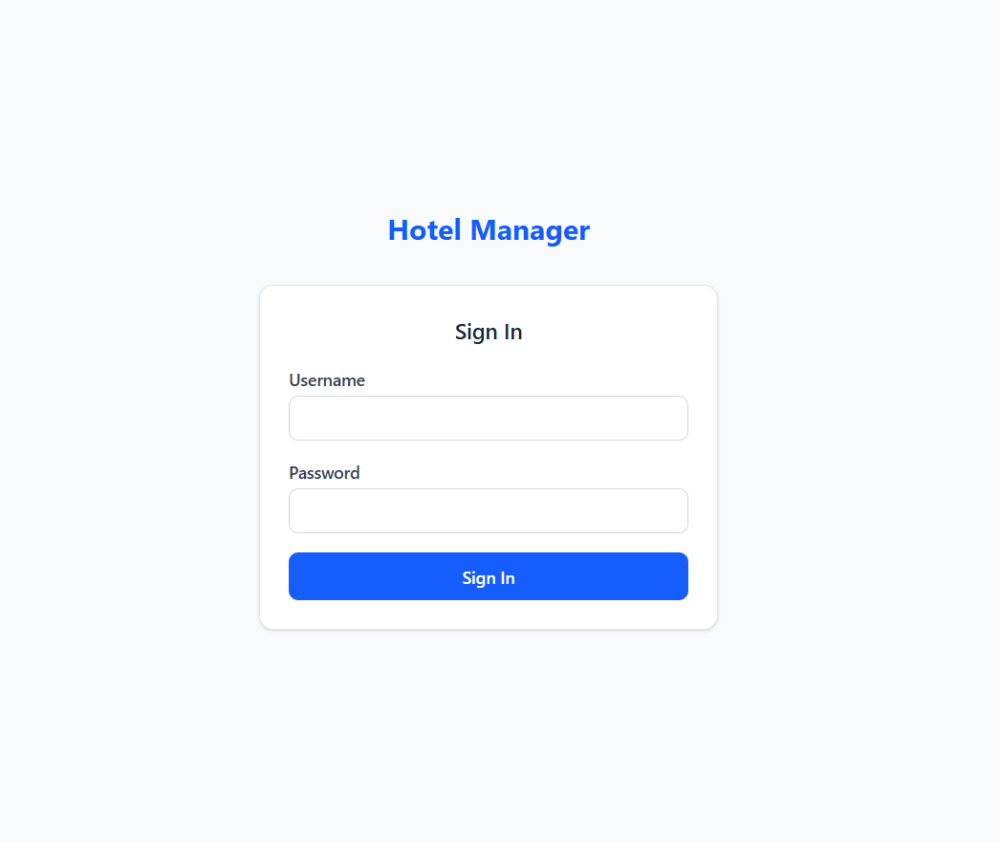 |

---

## 2. Dashboard

After authentication, users are presented with the main dashboard where they can quickly navigate to daily hotel operations.

Common actions include:

- Managing bookings
- Viewing rooms
- Managing guests
- Processing payments
- Generating reports

> | 🖥️ Main Dashboard View                                                                |
> | :------------------------------------------------------------------------------------ |
> | 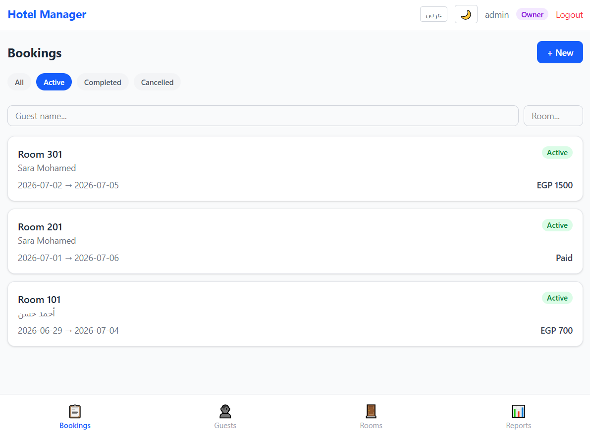 |

---

## 3. Create a Booking

Creating a booking involves more than inserting data.

The system automatically validates:

- Room availability
- Booking dates
- Guest information
- Business rules

Receptionists can:

- Select room
- Add primary guest
- Add accompanying guests
- Enter notes
- Calculate booking totals

> | 🖥️ New Booking Form                                                                       |
> | :---------------------------------------------------------------------------------------- |
> | 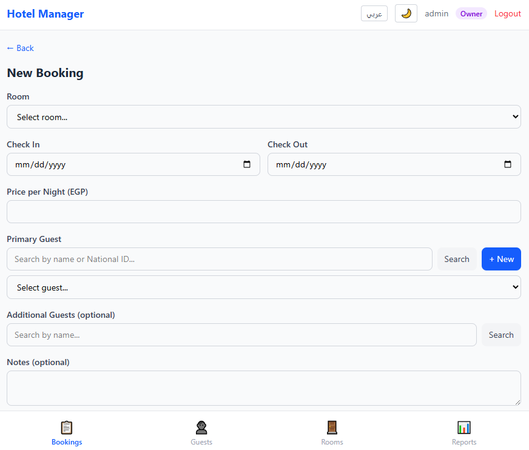 |

---

## 4. Booking Details

The booking details page centralizes all reservation information.

Displayed information includes:

- Guest details
- Room information
- Booking status
- Check-in / Check-out
- Outstanding balance
- Payment history

Available actions:

- Extend booking
- Complete booking
- Cancel booking _(Administrator only)_

> | 🖥️ Booking Details with Payment Tracking                                                          |
> | :------------------------------------------------------------------------------------------------ |
> | 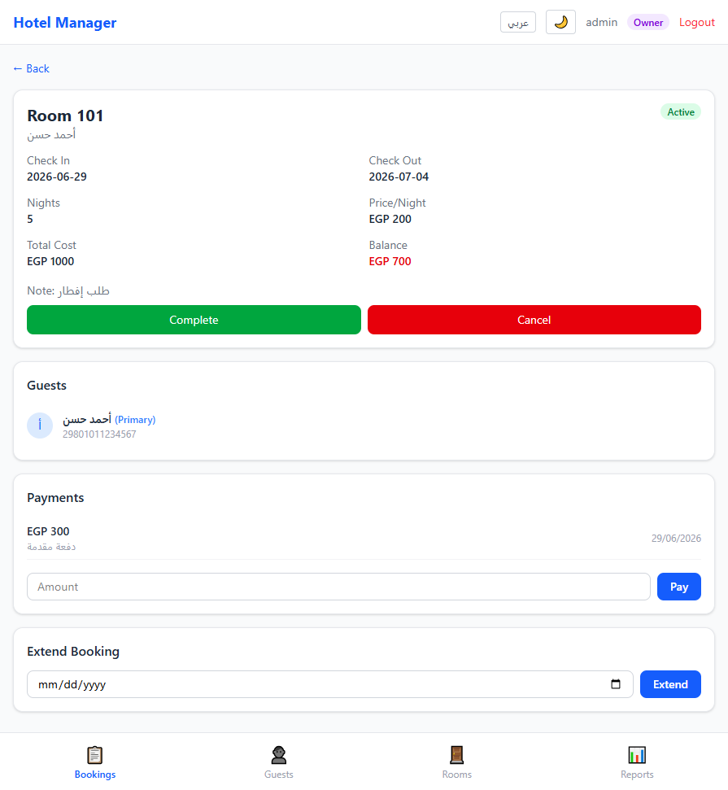 |

---

## 5. Guest Management

Guest records can be searched and managed efficiently.

Receptionists can:

- Search guests
- Update guest information
- Register new guests

> | 🖥️ Guest Management                                                             |
> | :------------------------------------------------------------------------------ |
> | 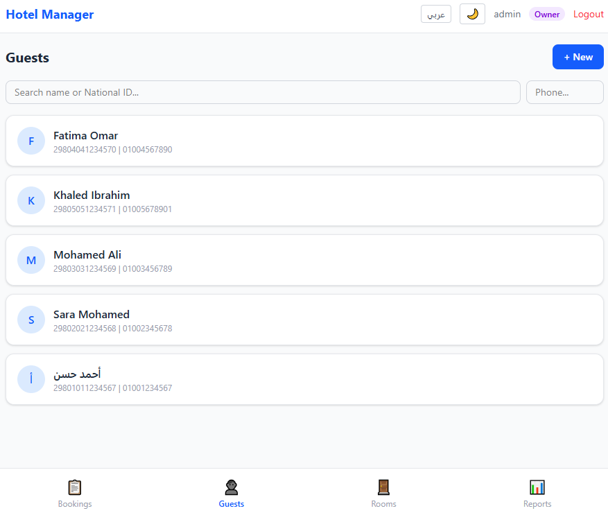 |

---

## 6. Room Management

Administrators manage hotel inventory through the room management module.

Features include:

- Room creation
- Room editing
- Room status
- Maintenance mode
- Pricing

> | 🖥️ Room Inventory with Real-Time Status                                       |
> | :---------------------------------------------------------------------------- |
> | 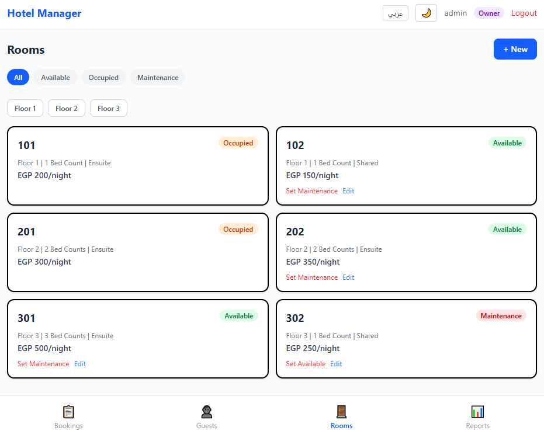 |

---

## 7. Payments

Payments are recorded directly against bookings.

The system automatically updates:

- Total paid
- Outstanding balance
- Booking financial summary

This reduces manual calculations and minimizes accounting errors.

---

## 8. Reports

Operational reports are generated using the hotel's Business Day instead of the system calendar.

Available reports include:

- Daily Report
- Period Report
- Outstanding Balances

These reports support receptionists during the Night Audit process.

> | 🖥️ Monthly Revenue Reports                                                                        |
> | :------------------------------------------------------------------------------------------------ |
> | 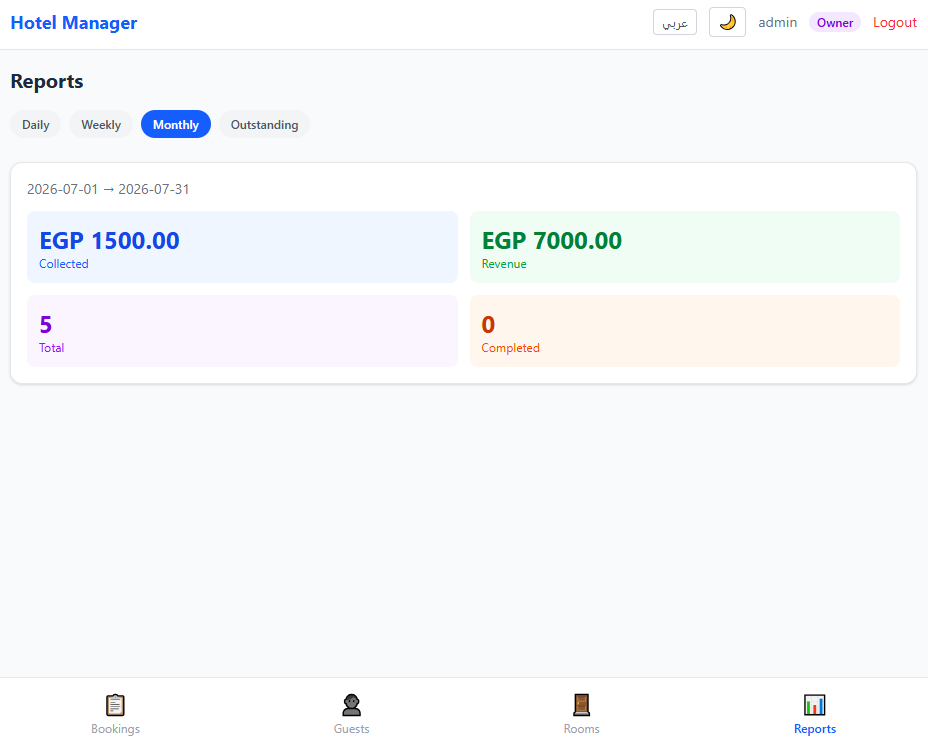 |

> | 🖥️ Outstanding Balance Reports                                                                            |
> | :-------------------------------------------------------------------------------------------------------- |
> | 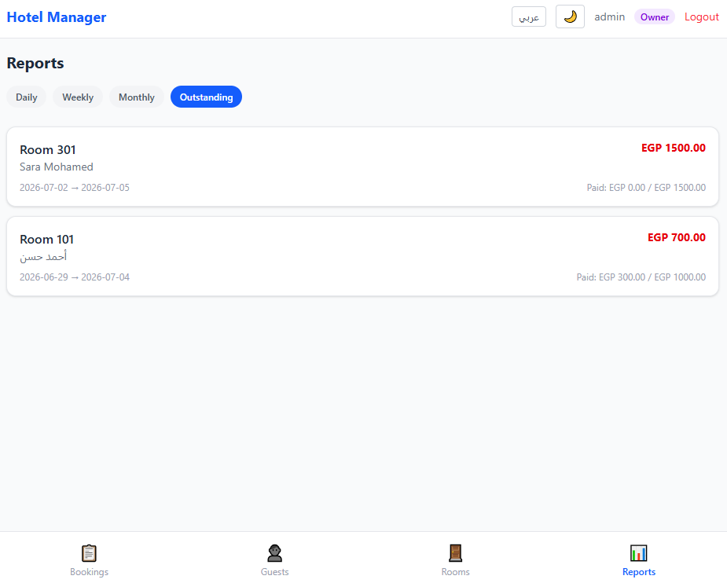 |

> | 🖥️ Reports Overview                                                               |
> | :-------------------------------------------------------------------------------- |
> | 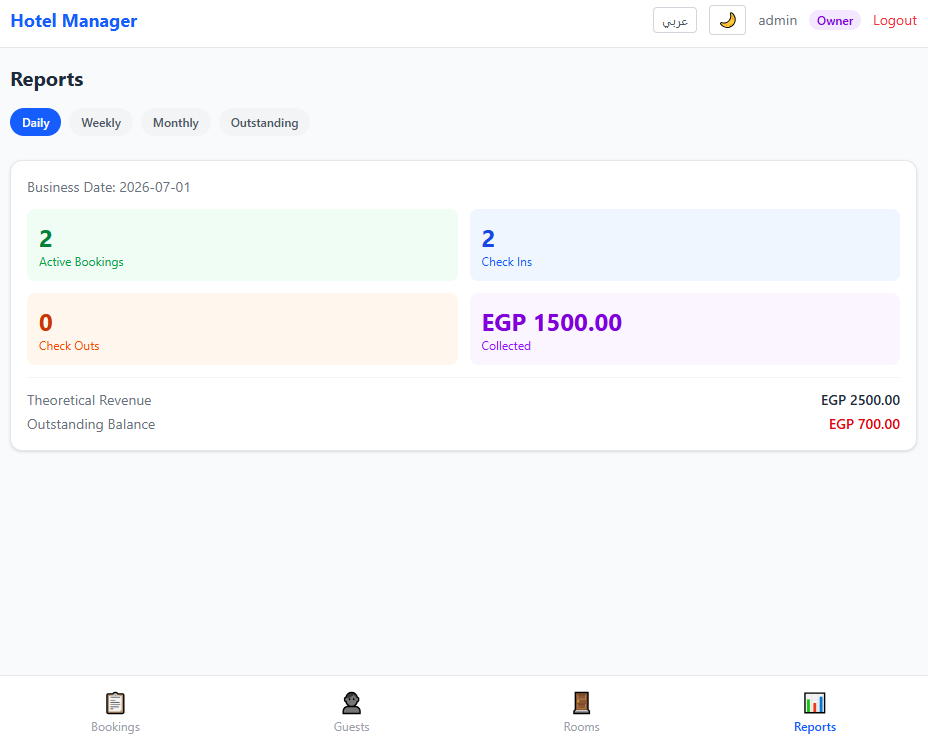 |

---

# Administrator Features

Administrators have additional permissions beyond receptionist capabilities.

Examples include:

- Employee management
- Room management
- Booking cancellation
- System administration

Role-based authorization ensures that sensitive operations are restricted to authorized users.

> | 🖥️ Admin Features                                                                               |
> | :---------------------------------------------------------------------------------------------- |
> | 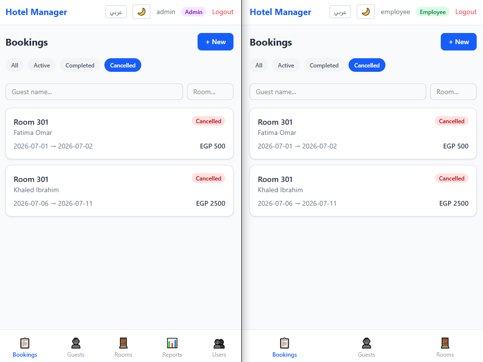 |

> | 🖥️ Admin — Manage Users                                                                                    |
> | :--------------------------------------------------------------------------------------------------------- |
> | 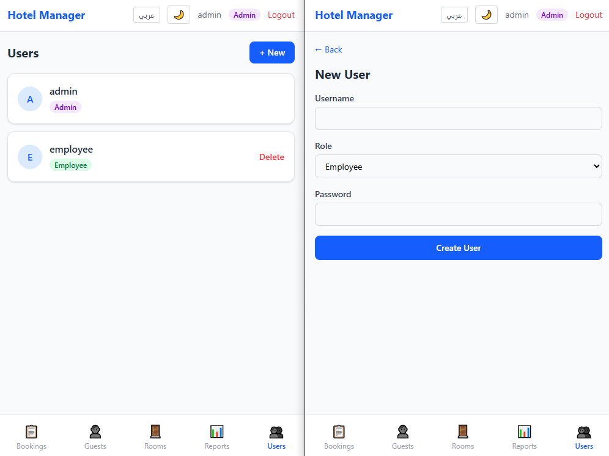 |

> | 🖥️ Admin — Cancel Booking                                                                                      |
> | :------------------------------------------------------------------------------------------------------------- |
> | 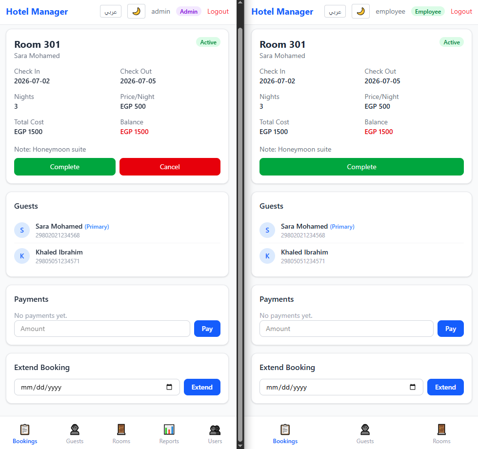 |

---

# Responsive Design

The frontend is designed with a mobile-first approach and adapts to different screen sizes.

Responsive improvements include:

- Flexible layouts
- Mobile navigation
- Touch-friendly controls
- Consistent user experience

> | 🖥️ Mobile — Bookings                                                                            |
> | :---------------------------------------------------------------------------------------------- |
> | 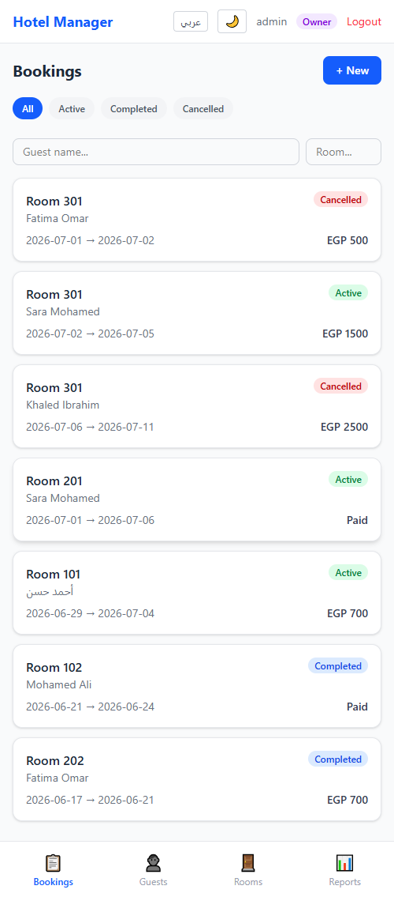 |

> | 🖥️ Mobile — Rooms                                                                           |
> | :------------------------------------------------------------------------------------------ |
> | 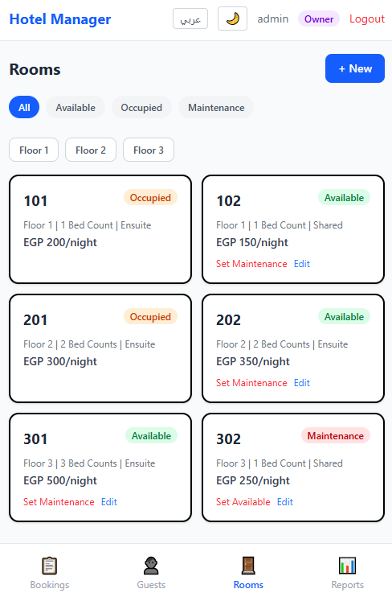 |

---

# Internationalization

The application supports both English and Arabic.

Features include:

- Runtime language switching
- Right-to-left (RTL) layout
- Persistent language preference

This makes the application suitable for multilingual hotel environments.

> | 🖥️ Arabic / RTL Interface                                                             |
> | :------------------------------------------------------------------------------------ |
> | 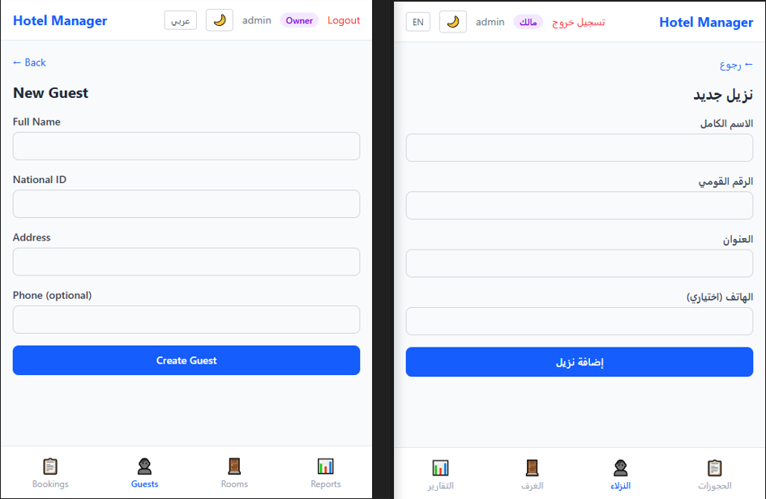 |

> | 🖥️ Dark Mode — Arabic                                                                           |
> | :---------------------------------------------------------------------------------------------- |
> | 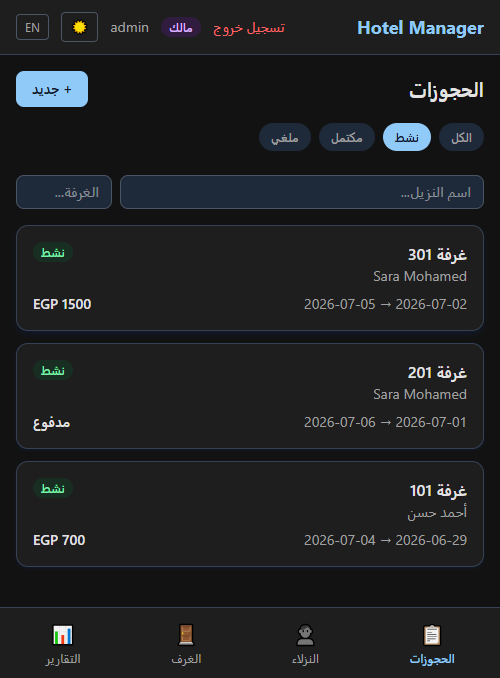 |

---

# Dark Mode

A persistent dark theme is available for users working extended reception shifts.

Theme preference is remembered between sessions, improving usability during day and night operations.

> | 🖥️ Dark Mode                                                                          |
> | :------------------------------------------------------------------------------------ |
> | 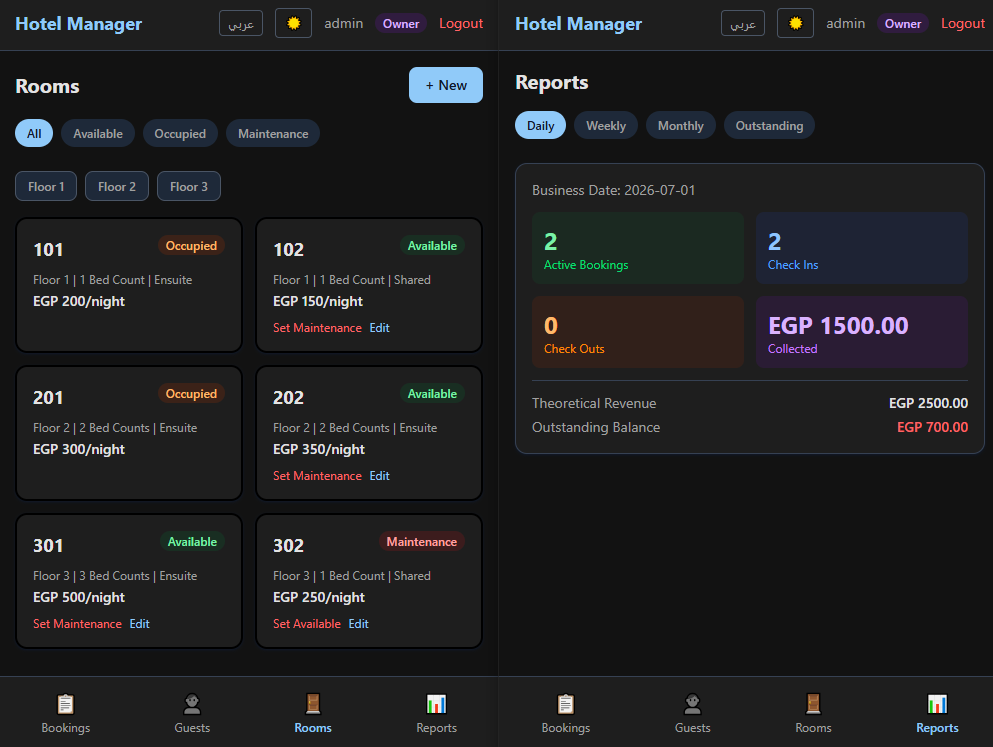 |

> | 🖥️ Dark Mode — English                                                                           |
> | :----------------------------------------------------------------------------------------------- |
> | 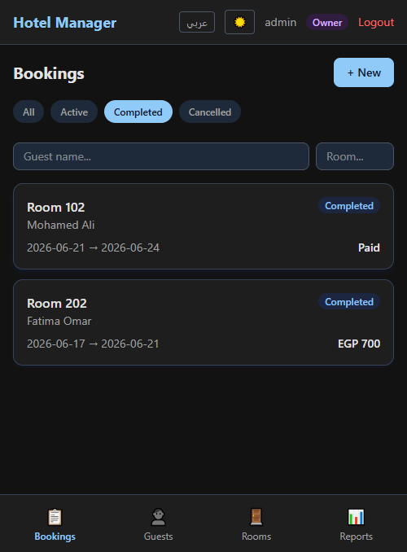 |

---

# 🏆 Code Quality & Engineering Practices

Writing software that works is only the first step. Throughout this project, equal emphasis was placed on maintainability, readability, testability, and long-term extensibility.

The following engineering practices guided the implementation.

---

# Clean Architecture

The application follows Clean Architecture to separate business logic from infrastructure and presentation concerns.

```text
Frontend (React)
        │
        ▼
ASP.NET Core API
        │
        ▼
Application Layer
        │
        ▼
Domain Layer
        ▲
        │
Infrastructure Layer
```

This architecture ensures that business rules remain independent from databases, frameworks, and UI technologies.

Benefits:

- Clear separation of responsibilities
- Easier testing
- Improved maintainability
- Infrastructure can evolve without affecting business logic

---

# Single Responsibility Principle

Large services were intentionally decomposed as the project evolved.

For example, the booking module was refactored from a single large service into focused components.

```text
BookingService
      │
      ├──────────────┐
      ▼              ▼
BookingQueryService
BookingAvailabilityService
```

Responsibilities:

| Service                    | Responsibility                                       |
| -------------------------- | ---------------------------------------------------- |
| BookingService             | Booking workflows (Create, Extend, Complete, Cancel) |
| BookingQueryService        | Read-only queries and searching                      |
| BookingAvailabilityService | Room availability validation                         |

This separation improves readability, testing, and future scalability.

---

# Thin Controllers

Controllers contain almost no business logic.

Their responsibilities are limited to:

- Receiving HTTP requests
- Model binding
- Authorization
- Calling Application Services
- Returning HTTP responses

Keeping controllers lightweight makes the codebase easier to understand and reduces duplication.

---

# Dependency Injection

All services are registered using ASP.NET Core's built-in Dependency Injection container.

Examples include:

- Authentication
- Booking management
- Guest management
- Payments
- Reports
- Room management
- User management

Benefits:

- Loose coupling
- Easier testing
- Clear dependency management
- Better extensibility

---

# DTO-Based API Design

The API never exposes Entity Framework entities directly.

Instead, Data Transfer Objects (DTOs) define the public contract between the backend and frontend.

Benefits:

- Smaller response payloads
- Better encapsulation
- Safer API evolution
- Reduced coupling

---

# Centralized Validation

All incoming requests are validated using FluentValidation.

Validation occurs before business logic executes.

Examples include:

- Login
- Booking creation
- Booking extension
- Guest creation
- Room creation
- Payments
- User creation

Benefits:

- Consistent validation rules
- Cleaner services
- Improved API reliability

---

# Global Exception Handling

Unhandled exceptions are processed by a centralized middleware.

The API returns standardized RFC 7807 ProblemDetails responses instead of exposing internal exceptions.

Benefits:

- Consistent error responses
- Better client experience
- Improved debugging
- Reduced duplicated error handling

---

# Consistent Asynchronous Programming

Database operations consistently use asynchronous APIs.

Examples include:

- ToListAsync()
- FirstOrDefaultAsync()
- SaveChangesAsync()

Using async/await helps improve scalability by preventing unnecessary thread blocking during I/O operations.

---

# Reusable Business Logic

Common business calculations are centralized rather than duplicated.

Examples:

- BookingCalculator
- BusinessDateHelper
- BookingMappings

This keeps services focused while ensuring business rules remain consistent across the application.

---

# Read Optimization

Read-only operations consistently use:

```csharp
AsNoTracking()
```

This avoids unnecessary Entity Framework change tracking for queries that do not modify data, reducing memory usage and improving performance.

---

# Testability

Business logic is designed to be testable.

The project currently includes:

- Service tests
- Validator tests
- Business helper tests

Result:

- 75 automated tests
- Safe refactoring
- Higher confidence during development

---

# Configuration Management

Application configuration is separated by environment.

Sensitive values such as:

- Connection strings
- JWT secret keys
- Deployment settings

are kept outside the source code.

This follows modern deployment and security practices.

---

# Consistent Naming

The project follows consistent naming conventions across the solution.

Examples:

Classes

- BookingService
- ReportService
- JwtTokenService

Interfaces

- IBookingService
- IUserService
- IApplicationDbContext

DTOs

- CreateBookingRequest
- BookingSummaryDto
- PeriodReportDto

This consistency improves readability and reduces cognitive load when navigating the codebase.

---

# Refactoring Culture

Rather than considering the first implementation as final, the project evolved through continuous refactoring.

Examples include:

- Splitting large services
- Removing duplicated logic
- Extracting reusable helpers
- Centralizing mappings
- Improving query performance
- Expanding automated tests

This reflects an important engineering principle:

> Code is not finished when it works—it is finished when it is understandable, maintainable, and easy to evolve.

---

# Pragmatic Engineering

Not every popular design pattern was adopted.

Several commonly used approaches were intentionally avoided because they would add complexity without providing meaningful value for the current scope.

Examples include:

- No generic Repository pattern on top of Entity Framework Core
- No MediatR or full CQRS implementation
- No microservices
- No premature caching
- No unnecessary abstractions

The objective was to build software that is easy to understand and maintain while avoiding accidental complexity.

Engineering decisions were driven by project requirements rather than trends.

---

# Engineering Philosophy

Throughout development, technical decisions were evaluated against three questions:

- Does this improve maintainability?
- Does it simplify future changes?
- Is the additional complexity justified?

The goal was not to implement every possible pattern, but to choose solutions that balanced simplicity, clarity, and long-term maintainability.

---

# 📚 Lessons Learned

Building this project taught me that software engineering is far more than writing code that works. Every iteration reinforced the importance of understanding business requirements, designing maintainable systems, and continuously improving the implementation through refactoring.

The lessons below represent the most valuable insights gained throughout the development of this project.

---

# Business Knowledge Comes First

One of the biggest lessons was that understanding the business domain is often more important than understanding a programming language.

Having previously worked as a hotel receptionist allowed me to identify workflows and business rules that are rarely covered in tutorials, including:

- Multi-guest bookings
- Room availability validation
- Night Audit workflow
- Business Day reporting
- Outstanding balance calculation
- Booking lifecycle management

This experience reinforced that successful software solves business problems—not just technical ones.

---

# Working Code Is Only the Beginning

Early implementations focused on delivering functionality.

As the project evolved, many parts of the application were revisited and improved through refactoring.

Examples include:

- Splitting large services into focused components
- Extracting reusable business logic
- Centralizing DTO mappings
- Optimizing read queries with `AsNoTracking()`
- Improving automated test coverage

This project taught me that maintainability is a continuous process rather than a final step.

---

# Simplicity Is Often the Better Design

Throughout development, I explored many popular architectural patterns.

Rather than adopting every pattern, I learned to evaluate whether each one actually solved a problem in the current project.

Examples include intentionally avoiding:

- Generic Repository pattern
- Full CQRS implementation
- Microservices
- Premature caching
- Over-abstraction

This reinforced an important principle:

> Good engineering is choosing the simplest solution that satisfies the requirements.

---

# Automated Testing Enables Confident Refactoring

As the project grew, automated tests became increasingly valuable.

Having a reliable test suite allowed architectural improvements to be made with confidence while reducing the risk of introducing regressions.

Instead of viewing testing as an optional step, I now consider it an essential part of the development process.

---

# Deployment Is Part of Software Engineering

Before this project, deployment felt like the final step.

This project changed that perspective.

Deploying the application required understanding:

- Hosting platforms
- Environment configuration
- CI/CD pipelines
- Secure secret management
- HTTPS
- Database providers

Seeing the application running in production highlighted that building software also includes operating it.

---

# Documentation Is a Technical Skill

Writing comprehensive documentation required organizing technical decisions, explaining architectural choices, and communicating complex ideas clearly.

This process improved my ability to explain not only _what_ was built, but also _why_ it was built that way.

I now view documentation as part of the software itself rather than something written after development is complete.

---

# Continuous Learning

This project marks an important milestone in my learning journey, but it is not the finish line.

Areas I plan to continue exploring include:

- Cloud-native development
- Docker Compose and container orchestration
- Refresh token authentication
- Integration and end-to-end testing
- Distributed caching
- Background job processing
- Observability and monitoring
- Azure cloud services

Each project provides new opportunities to improve both technical knowledge and engineering judgment.

---

# Key Takeaway

The most valuable lesson from this project is that writing software is not only about implementing features.

It is about understanding problems, making thoughtful engineering decisions, communicating those decisions clearly, and continuously improving the solution over time.

That mindset is the most important outcome of this project.

---

# 🚀 Engineering Journey

This project began with a simple goal:

**Build a hotel management system that reflects real hotel operations while strengthening my software engineering skills.**

At the time, I was transitioning from learning programming concepts to applying them in a complete, production-style application.

Because I had previously worked as a hotel receptionist, I wanted the software to solve problems I had personally experienced rather than creating another generic CRUD application.

As development progressed, the project evolved far beyond its original scope.

It became an opportunity to explore software architecture, secure authentication, automated testing, production deployment, continuous integration, frontend development, and the importance of writing maintainable code.

More importantly, it changed the way I approach software development.

Today, when implementing a feature, I try to think beyond making it work.

I ask questions such as:

- Does this solve a real business problem?
- Is this easy to understand?
- Can another developer maintain it?
- Is the additional complexity justified?
- How would this evolve in a production environment?

Those questions have become part of my engineering mindset.

This repository represents my current abilities—not my final destination.

I know there is still much to learn, and that is one of the reasons I enjoy software engineering.

Technology evolves constantly, and every project offers an opportunity to improve.

My goal is to continue growing as a software engineer by working on real products, collaborating with experienced developers, and learning from production systems.

Thank you for taking the time to explore this project.

I hope it demonstrates not only what I built, but also how I think as an engineer.

If you have feedback, suggestions, or would like to discuss the project, I would be happy to connect.

Happy coding! 🚀
